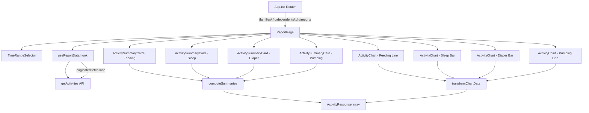

# Design Document: Activity Reporting

## Overview

The Activity Reporting feature adds a dedicated reporting page for each dependent that aggregates and visualizes activity data over configurable time ranges. The page is accessible from the existing `DependentDetailPage` and lives at `/families/:familyId/dependents/:dependentId/reports`.

The feature introduces:
- A `ReportPage` that fetches all activities for a date range (handling pagination) and renders summaries and charts
- A `TimeRangeSelector` component with preset buttons (Today, This Week, This Month) and custom date inputs
- Per-activity-type summary cards showing aggregated metrics (counts, totals, averages)
- Charts using Recharts: line graphs for feeding/pumping volume over time, bar graphs for sleep duration and diaper change counts per day
- Pure data transformation functions that convert raw `ActivityResponse[]` into chart-ready data structures

The design reuses the existing `useApi` hook pattern, `createApiClient(getToken)` for authenticated calls, and `react-bootstrap` for layout. Recharts is added as a new dependency for charting.

## Architecture



The architecture follows a unidirectional data flow:
1. `ReportPage` manages the selected time range state
2. `useReportData` custom hook fetches all paginated activities for the range using a `useCallback`-wrapped pagination loop triggered by `useEffect` with `[startDate, endDate]` dependencies (following the same `eslint-disable-next-line react-hooks/exhaustive-deps` pattern as `useApi`)
3. Pure functions (`computeSummaries`, `transformChartData`) derive display data from the raw activities array
4. Presentational components (`ActivitySummaryCard`, `ActivityChart`) render the derived data

This keeps data transformation logic testable in isolation from React components.

## Components and Interfaces

### New Route Registration (App.tsx)

A new `<Route>` is added inside the protected routes block:

```tsx
<Route
  path="/families/:familyId/dependents/:dependentId/reports"
  element={
    <ProtectedRoute>
      <ReportPage />
    </ProtectedRoute>
  }
/>
```

### ReportPage (`src/pages/ReportPage.tsx`)

Top-level page component. Manages time range state, fetches data via `useReportData`, and composes child components.

```typescript
interface ReportPageProps {}
// Uses useParams<{ familyId: string; dependentId: string }>() from react-router-dom
```

Responsibilities:
- Reads `familyId` and `dependentId` from route params
- Fetches dependent details for the page heading (reuses `getDependent`)
- Holds `startDate` / `endDate` state, defaulting to "Today"
- Holds `activePreset` state (`'today' | 'week' | 'month' | null`)
- Passes date range to `useReportData` hook
- Renders `TimeRangeSelector`, four `ActivitySummaryCard`s, and four `ActivityChart`s
- Shows loading spinner while data loads, error message on failure
- Shows a global empty state when no activities exist at all

### TimeRangeSelector (`src/components/reports/TimeRangeSelector.tsx`)

```typescript
interface TimeRangeSelectorProps {
  startDate: string;        // ISO date string (YYYY-MM-DD)
  endDate: string;          // ISO date string (YYYY-MM-DD)
  activePreset: 'today' | 'week' | 'month' | null;
  onPresetSelect: (preset: 'today' | 'week' | 'month') => void;
  onCustomRangeChange: (startDate: string, endDate: string) => void;
}
```

Renders three `ButtonGroup` preset buttons and two `Form.Control type="date"` inputs. The active preset button uses `variant="primary"` while inactive ones use `variant="outline-primary"`. When a custom date is changed, `onCustomRangeChange` is called and the parent sets `activePreset` to `null`.

### useReportData Hook (`src/hooks/useReportData.ts`)

```typescript
interface UseReportDataResult {
  activities: ActivityResponse[];
  loading: boolean;
  error: string | null;
}

function useReportData(
  familyId: string,
  dependentId: string,
  startDate: string,
  endDate: string
): UseReportDataResult;
```

This hook fetches all paginated activities for a date range. Unlike the "Load More" pattern used in `DependentDetailPage` and `PendingSharesPage`, reporting needs the complete dataset upfront for summaries and charts. The hook follows the same lint-safe approach established by `useApi`:

- A `useCallback` wraps the async pagination loop. This function calls `getActivities` in a loop, following `next_token` until all pages are retrieved, accumulating results into a local array before setting state once.
- A `useEffect` triggers the fetch function. It uses the same `eslint-disable-next-line react-hooks/exhaustive-deps` pattern as `useApi`, with `[startDate, endDate]` as the explicit dependency array. This ensures re-fetching when the date range changes without triggering the lint rule on the callback reference.
- State is managed with `useState` for `activities`, `loading`, and `error`.
- When `startDate` or `endDate` changes, the effect fires, which resets state and runs the full pagination loop.

Sketch of the internal structure:

```typescript
import { useState, useEffect, useCallback } from 'react';
import { createApiClient } from '../api/client';
import { getActivities } from '../api/activities';
import { useAuth } from '../auth/useAuth';
import type { ActivityResponse } from '../api/types';

export function useReportData(
  familyId: string,
  dependentId: string,
  startDate: string,
  endDate: string
): UseReportDataResult {
  const { getToken } = useAuth();
  const apiClient = createApiClient(getToken);

  const [activities, setActivities] = useState<ActivityResponse[]>([]);
  const [loading, setLoading] = useState(true);
  const [error, setError] = useState<string | null>(null);

  const fetchAllPages = useCallback(async () => {
    setLoading(true);
    setError(null);
    setActivities([]);

    let allActivities: ActivityResponse[] = [];
    let nextToken: string | undefined = undefined;

    // Pagination loop — fetch all pages for the date range
    do {
      const response = await getActivities(apiClient, familyId, dependentId, {
        startDate,
        endDate,
        next_token: nextToken,
      });

      if (response.error) {
        setError(response.error);
        setLoading(false);
        return;
      }

      if (response.data) {
        allActivities = [...allActivities, ...response.data.activities];
        nextToken = response.data.next_token ?? undefined;
      }
    } while (nextToken);

    setActivities(allActivities);
    setLoading(false);
  }, [apiClient, familyId, dependentId, startDate, endDate]);

  useEffect(() => {
    fetchAllPages();
    // eslint-disable-next-line react-hooks/exhaustive-deps
  }, [startDate, endDate]);

  return { activities, loading, error };
}
```

This mirrors how `useApi` works internally: a `useCallback`-wrapped fetch function triggered by a `useEffect` with an explicit dependency list and the eslint-disable comment. The key difference is the pagination loop that accumulates all pages before setting state, since the reporting view requires the full dataset.

### ActivitySummaryCard (`src/components/reports/ActivitySummaryCard.tsx`)

```typescript
interface ActivitySummaryCardProps {
  title: string;
  metrics: { label: string; value: string }[];
  variant: string;  // Bootstrap color variant for the card header
}
```

A simple presentational card that renders a title and a list of label/value metric pairs. Used for all four activity types.

### ActivityChart (`src/components/reports/ActivityChart.tsx`)

```typescript
type ChartType = 'line' | 'bar';

interface ChartDataPoint {
  label: string;   // X-axis label (date or datetime string)
  value: number;   // Y-axis value
}

interface ActivityChartProps {
  title: string;
  data: ChartDataPoint[];
  chartType: ChartType;
  yAxisLabel: string;
  xAxisLabel: string;
  color: string;
  emptyMessage: string;
}
```

Wraps Recharts `ResponsiveContainer`, `LineChart`/`BarChart`, `XAxis`, `YAxis`, `Tooltip`, and `Line`/`Bar` components. When `data` is empty, renders the `emptyMessage` text instead of a chart.

### Data Transformation Functions (`src/utils/reportUtils.ts`)

Pure functions that are the core logic of the feature. They take `ActivityResponse[]` and return derived data.

```typescript
// Summary computation
interface FeedingSummary {
  totalCount: number;
  totalVolumeMl: number;
  averageVolumeMl: number;
}

interface SleepSummary {
  totalCount: number;
  totalDurationMinutes: number;
  averageDurationMinutes: number;
}

interface DiaperSummary {
  totalCount: number;
  wetCount: number;
  dirtyCount: number;
  bothCount: number;
}

interface PumpingSummary {
  totalCount: number;
  totalVolumeMl: number;
  averageVolumeMl: number;
}

function computeFeedingSummary(activities: ActivityResponse[]): FeedingSummary;
function computeSleepSummary(activities: ActivityResponse[]): SleepSummary;
function computeDiaperSummary(activities: ActivityResponse[]): DiaperSummary;
function computePumpingSummary(activities: ActivityResponse[]): PumpingSummary;

// Chart data transformation
function transformFeedingChartData(activities: ActivityResponse[]): ChartDataPoint[];
function transformSleepChartData(activities: ActivityResponse[]): ChartDataPoint[];
function transformDiaperChartData(activities: ActivityResponse[]): ChartDataPoint[];
function transformPumpingChartData(activities: ActivityResponse[]): ChartDataPoint[];
```

Key transformation rules:
- `computeFeedingSummary`: Filters to `type === 'feeding'`. Counts all. Sums `volume_ml` only for activities where `volume_ml` is defined. Average = total volume / count of activities with volume (not total count).
- `computeSleepSummary`: Filters to `type === 'sleep'`. Excludes activities missing `start_time` or `end_time` from duration calculations. Duration = `end_time - start_time` in minutes.
- `computeDiaperSummary`: Filters to `type === 'diaper_change'`. Counts by `contents` field (`wet`, `dirty`, `both`).
- `computePumpingSummary`: Filters to `type === 'pumping'`. Sums `volume_ml` only for activities where defined. Average = total volume / count with volume.
- `transformFeedingChartData`: Groups feeding activities by timestamp, each point is `{ label: timestamp, value: volume_ml }`. Activities without `volume_ml` are excluded from the chart.
- `transformSleepChartData`: Groups by calendar day (YYYY-MM-DD). Sums duration in minutes per day. Each point is `{ label: date, value: totalMinutes }`.
- `transformDiaperChartData`: Groups by calendar day. Counts per day. Each point is `{ label: date, value: count }`.
- `transformPumpingChartData`: Groups by timestamp, each point is `{ label: timestamp, value: volume_ml }`. Activities without `volume_ml` are excluded.

### Date Range Utility Functions (`src/utils/reportUtils.ts`)

```typescript
function getPresetDateRange(preset: 'today' | 'week' | 'month'): { startDate: string; endDate: string };
```

- `today`: Start = today at 00:00, End = today at 23:59:59
- `week`: Start = most recent Monday at 00:00, End = today at 23:59:59
- `month`: Start = 1st of current month at 00:00, End = today at 23:59:59

Returns ISO date strings suitable for the API query params.

## Data Models

### Existing Types (no changes)

The feature relies entirely on existing API types from `src/api/types.ts`:
- `ActivityResponse` — the core data record with `type`, `timestamp`, `volume_ml`, `start_time`, `end_time`, `contents`, `feeding_type`
- `ActivityListResponse` — paginated list with `activities[]` and `next_token`
- `ActivityType` — union type `'feeding' | 'diaper_change' | 'sleep' | 'pumping'`
- `FeedingType`, `DiaperContents` — sub-type enums

### New Types

```typescript
// Time range preset type
type TimeRangePreset = 'today' | 'week' | 'month';

// Chart data point (shared across all chart types)
interface ChartDataPoint {
  label: string;
  value: number;
}

// Summary types per activity (defined above in Components section)
interface FeedingSummary { ... }
interface SleepSummary { ... }
interface DiaperSummary { ... }
interface PumpingSummary { ... }
```

No new API endpoints or backend changes are required. All data is derived client-side from the existing `getActivities` endpoint with date range filtering.


## Correctness Properties

*A property is a characteristic or behavior that should hold true across all valid executions of a system — essentially, a formal statement about what the system should do. Properties serve as the bridge between human-readable specifications and machine-verifiable correctness guarantees.*

### Property 1: Preset date range computation

*For any* date and any preset (`today`, `week`, `month`), calling `getPresetDateRange(preset)` with that date as "now" should produce a `startDate` that is:
- For `today`: the same calendar day at midnight
- For `week`: the most recent Monday at midnight (or today if today is Monday)
- For `month`: the 1st of the current month at midnight

And the `endDate` should always be the current day. The `startDate` must always be ≤ `endDate`.

**Validates: Requirements 2.3, 2.4**

### Property 2: Activity count by type

*For any* list of `ActivityResponse` objects and *for any* activity type, the computed summary count for that type must equal the number of activities in the list whose `type` field matches.

**Validates: Requirements 4.1, 5.1, 6.1, 7.1**

### Property 3: Volume summary correctness for feeding and pumping

*For any* list of `ActivityResponse` objects of type `feeding` or `pumping`, the computed total volume must equal the sum of `volume_ml` for only those activities where `volume_ml` is defined. The computed average volume must equal the total volume divided by the count of activities that have `volume_ml` defined. If no activities have `volume_ml`, both total and average must be zero.

**Validates: Requirements 4.2, 4.3, 7.2, 7.3, 9.3**

### Property 4: Sleep duration summary correctness

*For any* list of `ActivityResponse` objects of type `sleep`, the computed total duration must equal the sum of `(end_time - start_time)` in minutes for only those activities where both `start_time` and `end_time` are defined. The computed average duration must equal the total duration divided by the count of valid sleep activities. If no valid sleep activities exist, both total and average must be zero.

**Validates: Requirements 5.2, 5.3, 9.2**

### Property 5: Diaper sub-type counts partition the total

*For any* list of `ActivityResponse` objects of type `diaper_change`, the sum of `wetCount + dirtyCount + bothCount` must equal the `totalCount`. Each sub-count must equal the number of activities whose `contents` field matches the respective value.

**Validates: Requirements 6.2**

### Property 6: Sleep chart data groups durations by calendar day

*For any* list of valid sleep activities (with both `start_time` and `end_time`), `transformSleepChartData` must produce one `ChartDataPoint` per unique calendar day. The `value` for each day must equal the sum of sleep durations (in minutes) for all sleep activities on that day. The total of all chart point values must equal the total duration computed by `computeSleepSummary`.

**Validates: Requirements 5.4**

### Property 7: Diaper chart data groups counts by calendar day

*For any* list of diaper change activities, `transformDiaperChartData` must produce one `ChartDataPoint` per unique calendar day. The `value` for each day must equal the number of diaper change activities on that day. The sum of all chart point values must equal the total count from `computeDiaperSummary`.

**Validates: Requirements 6.3**

### Property 8: Pagination accumulates all activities

*For any* sequence of paginated API responses (each with an `activities` array and optional `next_token`), the `useReportData` hook must accumulate all activities from all pages into a single array whose length equals the sum of all individual page lengths.

**Validates: Requirements 3.4**

## Error Handling

| Scenario | Handling |
|---|---|
| API fetch error | `useReportData` sets `error` state; `ReportPage` renders `<ErrorMessage>` component with the error string |
| Network timeout | Handled by existing `ApiClient` timeout logic (30s); surfaces as error string via `useReportData` |
| Empty activity list | `ReportPage` checks `activities.length === 0` and renders a global "No activities found" message |
| Empty per-type data | Each `ActivityChart` receives empty `data[]` and renders its `emptyMessage` prop instead of a chart |
| Sleep activity missing start_time or end_time | `computeSleepSummary` and `transformSleepChartData` filter these out before calculations |
| Feeding/pumping activity missing volume_ml | `computeFeedingSummary`, `computePumpingSummary`, and chart transforms filter these out of volume calculations |
| Invalid date range (start > end) | `TimeRangeSelector` can optionally disable the submit or show a validation message; the API will return an empty result set |
| Auth token expired | Existing `ApiClient` handles 401 by dispatching `auth:expired` event, triggering re-authentication flow |

## Testing Strategy

### Unit Tests

Unit tests verify specific examples, edge cases, and component rendering:

- `TimeRangeSelector` renders three preset buttons and two date inputs
- Clicking a preset button calls `onPresetSelect` with the correct value
- Entering custom dates calls `onCustomRangeChange`
- Active preset button has the correct visual variant
- `ActivitySummaryCard` renders title and all metric label/value pairs
- `ActivityChart` renders empty message when data is empty
- `ReportPage` shows loading spinner while data is loading
- `ReportPage` shows error message when API returns error
- `ReportPage` shows global empty state when no activities exist
- `getPresetDateRange('today')` returns correct range for a known date
- Summary functions return zero metrics for empty input arrays

### Property-Based Tests

Property-based tests use `fast-check` (already in devDependencies) to verify universal properties across randomized inputs. Each test runs a minimum of 100 iterations.

Each property test must be tagged with a comment referencing the design property:

```typescript
// Feature: activity-reporting, Property 1: Preset date range computation
```

Properties to implement:

1. **Preset date range computation** — Generate random dates and presets, verify `getPresetDateRange` produces valid ranges with correct anchor points.
2. **Activity count by type** — Generate random arrays of `ActivityResponse` with mixed types, verify each type's count matches a simple filter.
3. **Volume summary correctness** — Generate random feeding/pumping activities with and without `volume_ml`, verify total and average calculations.
4. **Sleep duration summary correctness** — Generate random sleep activities with and without valid start/end times, verify duration calculations exclude invalid entries.
5. **Diaper sub-type counts partition** — Generate random diaper change activities with random `contents` values, verify sub-counts sum to total.
6. **Sleep chart data groups by day** — Generate random valid sleep activities across multiple days, verify chart points group correctly and sum matches total.
7. **Diaper chart data groups by day** — Generate random diaper activities across multiple days, verify chart points group correctly and sum matches total.
8. **Pagination accumulation** — Generate random sequences of paginated responses, verify accumulated array length equals sum of page lengths.

### Test Configuration

- Library: `fast-check` v4.x (already installed)
- Runner: `vitest` with `--run` flag for single execution
- Minimum iterations: 100 per property test
- Test file locations:
  - Unit tests: `src/utils/reportUtils.test.ts`, `src/components/reports/*.test.tsx`
  - Property tests: `src/utils/reportUtils.property.test.ts`
