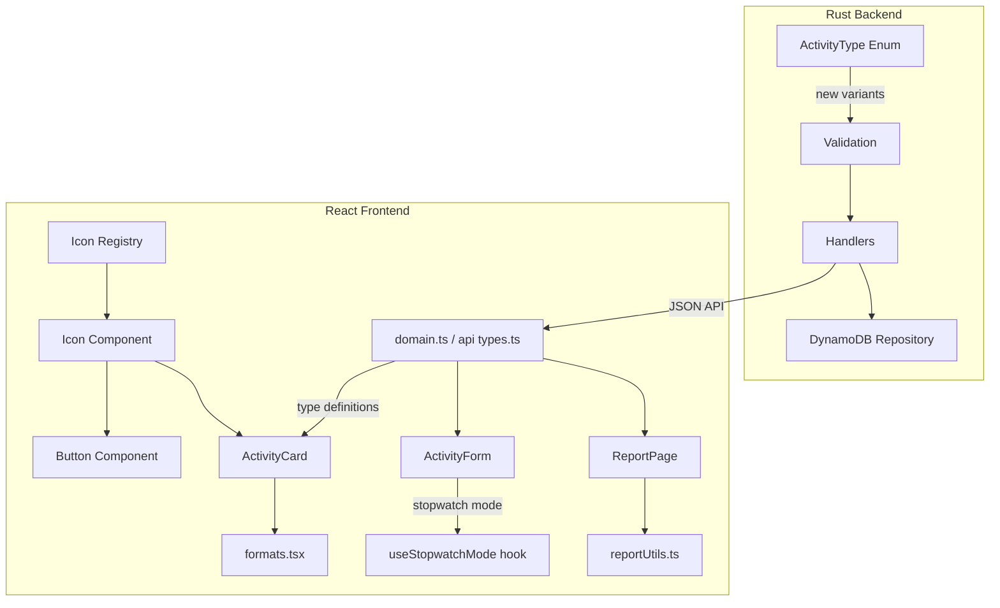

# Design Document: Bootstrap Icons Integration

## Overview

This design covers the integration of Bootstrap Icons into the FamTrac application, along with three new backend activity types (`activity_time`, `tummy_time`, `wake_window`), sleep duration formatting improvements, a stopwatch mode for duration-based activities, a stop icon for in-progress stopwatch activities, and full frontend support for the new activity types.

The changes span both the Rust backend (new `ActivityType` enum variants, validation) and the React/TypeScript frontend (icon registry, Icon component, updated activity cards/forms/reports, new TypeScript types).

### Key Design Decisions

1. **SVG-string icon registry over icon font**: Icons are stored as raw SVG markup strings in a TypeScript map. This avoids loading an entire icon font, keeps the bundle small, and allows tree-shaking unused icons.
2. **Shared stopwatch mode logic**: Sleep, activity_time, tummy_time, and wake_window all share the same stopwatch toggle pattern. A shared helper/hook will reduce duplication.
3. **Duration formatting as a pure utility**: The `formatDuration` function is a pure function (minutes → "Xh Ym") used by both activity cards and report summaries, making it easy to test.
4. **Backend enum extension with serde tagging**: New variants are added to the existing `#[serde(tag = "type", rename_all = "snake_case")]` enum, ensuring wire-format consistency with zero migration cost.

## Architecture

The feature touches three layers:



### Change Summary by Layer

**Backend (`famtrac-backend/`)**:
- `src/domain/activity.rs`: Add `ActivityTime`, `TummyTime`, `WakeWindow` variants to `ActivityType`
- `src/domain/mod.rs`: No changes needed (re-exports `ActivityType` already)
- `src/errors/validation.rs`: Add validation arms for the three new variants
- No handler changes needed — existing CRUD handlers use `ActivityType` generically via serde

**Frontend (`famtrac-frontend/`)**:
- `src/utils/iconRegistry.ts` (new): Icon name → SVG string map
- `src/components/common/Icon.tsx` (new): Reusable `<Icon>` component
- `src/components/common/Button.tsx`: Add optional `icon` prop
- `src/components/activities/ActivityCard.tsx`: Add activity type icon next to badge; use `formatDuration`
- `src/components/activities/ActivityForm.tsx`: Add new activity types to selector; add stopwatch toggle for duration-based types
- `src/components/activities/formats.tsx`: Add labels/badges/details for new types; replace minutes display with `formatDuration`
- `src/utils/formatDuration.ts` (new): Pure `formatDuration(minutes)` → "Xh Ym" utility
- `src/utils/reportUtils.ts`: Update sleep chart y-axis to hours; add wake_window summary computation
- `src/pages/ReportPage.tsx`: Display sleep/wake_window durations in hours format
- `src/types/domain.ts`: Add new activity type interfaces and union members
- `src/api/types.ts`: Extend `ActivityType`, request/response types

## Components and Interfaces

### 1. Icon Registry (`src/utils/iconRegistry.ts`)

```typescript
/** Map of icon names to Bootstrap Icons SVG markup strings */
export const iconRegistry: Record<string, string> = {
  pencil: '<svg ...>...</svg>',
  trash: '<svg ...>...</svg>',
  eye: '<svg ...>...</svg>',
  plus: '<svg ...>...</svg>',
  stop: '<svg ...>...</svg>',            // bi-stop-fill (square stop icon)
  feeding: '<svg ...>...</svg>',       // e.g. bi-cup-straw
  diaper_change: '<svg ...>...</svg>', // e.g. bi-droplet
  sleep: '<svg ...>...</svg>',         // e.g. bi-moon
  pumping: '<svg ...>...</svg>',       // e.g. bi-moisture
  activity_time: '<svg ...>...</svg>', // e.g. bi-controller
  tummy_time: '<svg ...>...</svg>',    // e.g. bi-person-arms-up
  wake_window: '<svg ...>...</svg>',   // e.g. bi-sun
};

/** Look up an icon by name. Returns undefined for unknown names. */
export function getIcon(name: string): string | undefined {
  return iconRegistry[name];
}
```

### 2. Icon Component (`src/components/common/Icon.tsx`)

```typescript
interface IconProps {
  name: string;
  size?: number;    // defaults to 16
  className?: string;
}

export function Icon({ name, size = 16, className }: IconProps): JSX.Element | null
```

- Looks up `name` in the icon registry
- Returns `null` if not found (Req 2.5)
- Renders SVG with `aria-hidden="true"`, `width`/`height` set to `size` (Req 2.2, 2.4)
- Uses `dangerouslySetInnerHTML` on a wrapper `<span>` since SVG strings come from a trusted, compile-time registry

### 3. Button Component Changes (`src/components/common/Button.tsx`)

Add an optional `icon` prop:

```typescript
export interface ButtonProps {
  // ... existing props
  icon?: string; // icon registry name
}
```

When `icon` is provided, render `<Icon name={icon} size={14} className="me-1" />` before `children`. Existing text labels are preserved (Req 3.5).

### 4. ActivityCard Changes

- Import `Icon` component
- Render `<Icon name={activity.type} size={14} className="me-1" />` inside the `<Badge>` next to the type label (Reqs 4.1–4.4, 8.4, 9.4, 10.4)
- Replace sleep duration "X minutes" with `formatDuration(minutes)` → "Xh Ym" (Req 5.1)
- For sleep/activity_time/tummy_time/wake_window without `end_time`, display "In Progress" (Reqs 6.6, 8.6, 9.6, 10.6)
- For stopwatch-type activities (sleep, activity_time, tummy_time, wake_window) without `end_time`, render `<Icon name="stop" size={14} className="text-danger ms-1" />` next to the "In Progress" text to visually indicate the activity can be stopped (Reqs 6.7, 8.8, 9.8, 10.8)
- Once `end_time` is set (activity is complete), the stop icon is not rendered (Reqs 6.8, 8.9, 9.9, 10.9)

### 5. ActivityForm Changes

- Add `activity_time`, `tummy_time`, `wake_window` to the `<Form.Select>` options (Reqs 8.2, 9.2, 10.2)
- For `sleep`, `activity_time`, `tummy_time`, `wake_window`: show a "Stopwatch Mode" `<Form.Check type="switch">` toggle (Reqs 6.1, 8.7, 9.7, 10.7)
- When stopwatch mode is on: hide end_time field, use start_time as timestamp, don't require end_time (Reqs 6.2–6.4)
- When stopwatch mode is off: require both start_time and end_time (Req 6.5)
- `activity_time`: show optional description text field (Req 8.3)
- `tummy_time`: show optional notes text field (Req 9.3)
- `wake_window`: show start_time and optional end_time only (Req 10.3)

### 6. Format Utilities

**`formatDuration(totalMinutes: number): string`** (new file `src/utils/formatDuration.ts`):
- `formatDuration(150)` → `"2h 30m"`
- `formatDuration(45)` → `"0h 45m"`
- `formatDuration(0)` → `"0h 0m"`

**`formats.tsx` updates**:
- Add `getActivityTypeLabel` cases for `activity_time` → "Activity Time", `tummy_time` → "Tummy Time", `wake_window` → "Wake Window"
- Add `getActivityTypeBadgeVariant` cases for new types
- Add `renderActivityDetails` cases for new types, using `formatDuration` for duration display

### 7. Report Utilities Changes (`reportUtils.ts`)

- `transformSleepChartData`: Change values from minutes to decimal hours (value / 60)
- `computeSleepSummary`: Keep internal computation in minutes; the display layer uses `formatDuration`
- Add `computeWakeWindowSummary` function mirroring `computeSleepSummary`
- Add `transformWakeWindowChartData` function mirroring `transformSleepChartData`

### 8. ReportPage Changes

- Sleep chart `yAxisLabel`: change from `"Duration (min)"` to `"Duration (hours)"`
- Sleep summary card: already uses `formatMinutes` which formats as "Xh Ym" — rename to `formatDuration` import
- Add Wake Window summary card and chart alongside sleep

### 9. Backend ActivityType Enum Extension

```rust
#[derive(Debug, Clone, PartialEq, Eq, Serialize, Deserialize)]
#[serde(tag = "type", rename_all = "snake_case")]
pub enum ActivityType {
    // ... existing variants ...
    ActivityTime {
        start_time: Timestamp,
        #[serde(skip_serializing_if = "Option::is_none")]
        end_time: Option<Timestamp>,
        #[serde(skip_serializing_if = "Option::is_none")]
        description: Option<String>,
    },
    TummyTime {
        start_time: Timestamp,
        #[serde(skip_serializing_if = "Option::is_none")]
        end_time: Option<Timestamp>,
        #[serde(skip_serializing_if = "Option::is_none")]
        notes: Option<String>,
    },
    WakeWindow {
        start_time: Timestamp,
        #[serde(skip_serializing_if = "Option::is_none")]
        end_time: Option<Timestamp>,
    },
}
```

### 10. Backend Validation Extension

Add arms to `validate_activity_type` for the three new variants:
- All three: if `end_time` is `Some`, validate `end_time > start_time`
- `ActivityTime`: `start_time` is required (enforced by struct); `description` if present, sanitize and validate length ≤ 500
- `TummyTime`: `start_time` is required; `notes` if present, sanitize and validate length ≤ 500
- `WakeWindow`: `start_time` is required; no additional text fields

## Data Models

### Backend Domain Changes

**`ActivityType` enum** (in `famtrac-backend/src/domain/activity.rs`):

| Variant | Fields | Serialized `type` tag |
|---|---|---|
| `ActivityTime` | `start_time: Timestamp`, `end_time: Option<Timestamp>`, `description: Option<String>` | `"activity_time"` |
| `TummyTime` | `start_time: Timestamp`, `end_time: Option<Timestamp>`, `notes: Option<String>` | `"tummy_time"` |
| `WakeWindow` | `start_time: Timestamp`, `end_time: Option<Timestamp>` | `"wake_window"` |

No DynamoDB schema changes are needed — the `Activity` item stores `activity_type` as a JSON-serialized attribute, so new variants are stored transparently.

### Frontend Type Changes

**`src/types/domain.ts`**:

```typescript
export type ActivityType =
  | 'feeding' | 'diaper_change' | 'sleep' | 'pumping'
  | 'activity_time' | 'tummy_time' | 'wake_window';

export interface ActivityTimeActivity extends BaseActivity {
  activity_type: 'activity_time';
  start_time: string;
  end_time?: string;
  description?: string;
}

export interface TummyTimeActivity extends BaseActivity {
  activity_type: 'tummy_time';
  start_time: string;
  end_time?: string;
  notes?: string;
}

export interface WakeWindowActivity extends BaseActivity {
  activity_type: 'wake_window';
  start_time: string;
  end_time?: string;
}

export type Activity =
  | FeedingActivity | DiaperActivity | SleepActivity | PumpingActivity
  | ActivityTimeActivity | TummyTimeActivity | WakeWindowActivity;
```

**`src/api/types.ts`**:

```typescript
export type ActivityType =
  | 'feeding' | 'diaper_change' | 'sleep' | 'pumping'
  | 'activity_time' | 'tummy_time' | 'wake_window';

// CreateActivityRequest, UpdateActivityRequest, ActivityResponse:
// Add optional fields: description?: string, notes?: string
```


## Correctness Properties

*A property is a characteristic or behavior that should hold true across all valid executions of a system — essentially, a formal statement about what the system should do. Properties serve as the bridge between human-readable specifications and machine-verifiable correctness guarantees.*

### Property 1: Icon registry lookup correctness

*For any* string, looking it up in the icon registry should return a non-empty SVG string if and only if the string is one of the known icon names (pencil, trash, eye, plus, stop, feeding, diaper_change, sleep, pumping, activity_time, tummy_time, wake_window). For any string not in that set, the lookup should return `undefined`.

**Validates: Requirements 1.3, 1.4, 1.5**

### Property 2: Icon component rendering correctness

*For any* icon name string and any positive integer size, the Icon component should: (a) if the name exists in the registry, render an element containing SVG markup with `aria-hidden="true"`, `width` and `height` equal to the given size (defaulting to 16), and any provided `className` applied; (b) if the name does not exist in the registry, render nothing (null).

**Validates: Requirements 2.1, 2.2, 2.3, 2.4, 2.5**

### Property 3: Button text preservation with icon

*For any* button with an `icon` prop and text children, the rendered output should contain both the icon element and the original text content unchanged.

**Validates: Requirements 3.5**

### Property 4: Duration formatting

*For any* non-negative integer representing total minutes, `formatDuration(minutes)` should return a string in the format `"Xh Ym"` where `X = floor(minutes / 60)` and `Y = minutes % 60`, and parsing `X * 60 + Y` back should equal the original input.

**Validates: Requirements 5.1, 5.3, 8.5, 9.5, 10.5**

### Property 5: Backend ActivityType serialization round-trip

*For any* valid `ActivityType` value (including `ActivityTime`, `TummyTime`, and `WakeWindow` variants with arbitrary valid field values), serializing to JSON and then deserializing back should produce a value equal to the original. Additionally, the serialized JSON `type` field should use snake_case naming (`"activity_time"`, `"tummy_time"`, `"wake_window"`).

**Validates: Requirements 7.1, 7.2, 7.3, 7.7**

### Property 6: Stop icon visibility for in-progress stopwatch activities

*For any* activity of a stopwatch type (sleep, activity_time, tummy_time, wake_window), the ActivityCard should render a stop icon if and only if the activity has no `end_time`. When `end_time` is present, the stop icon should not be rendered.

**Validates: Requirements 6.7, 6.8, 8.8, 8.9, 9.8, 9.9, 10.8, 10.9**

## Error Handling

### Backend

| Scenario | Error | HTTP Status |
|---|---|---|
| Missing `start_time` in new activity type JSON | Serde deserialization error | 400 Bad Request |
| `end_time` ≤ `start_time` for new variants | `ValidationError` on `end_time` field | 400 Bad Request |
| `description` or `notes` exceeds 500 chars | `ValidationError` on respective field | 400 Bad Request |
| Unknown `type` tag in JSON | Serde deserialization error | 400 Bad Request |

The existing error handling pipeline in `handlers/activity.rs` already converts `serde_json` parse errors and `ValidationError` into appropriate HTTP responses. No new error types are needed.

### Frontend

| Scenario | Behavior |
|---|---|
| Unknown icon name passed to `<Icon>` | Renders nothing (returns `null`) |
| Unknown icon name passed to `<Button icon>` | Button renders without icon, text preserved |
| Activity with missing `end_time` displayed | Shows "In Progress" with stop icon instead of duration |
| Stopwatch mode on: form submitted without `end_time` | Valid submission — `end_time` omitted from request |
| New activity type not recognized by older frontend | Falls through to `default` case in switch statements, renders generic display |

## Testing Strategy

### Unit Tests

Unit tests cover specific examples, edge cases, and integration points:

**Backend (Rust, using `#[test]` and `proptest`)**:
- Serialization examples for each new `ActivityType` variant with all field combinations (all fields present, optional fields absent)
- Validation edge cases: `end_time` equal to `start_time`, `end_time` before `start_time`, missing `start_time` (deserialization failure)
- Description/notes length boundary: exactly 500 chars (valid), 501 chars (invalid)

**Frontend (Vitest + React Testing Library + fast-check)**:
- Icon registry: verify all expected keys are present (Req 1.1)
- ActivityCard rendering: one example per activity type showing icon presence (Reqs 4.1–4.4, 8.4, 9.4, 10.4)
- ActivityCard "In Progress" display with stop icon for activities without `end_time` (Reqs 6.6–6.8, 8.6, 8.8–8.9, 9.6, 9.8–9.9, 10.6, 10.8–10.9)
- ActivityCard stop icon absence for completed activities with `end_time` (Reqs 6.8, 8.9, 9.9, 10.9)
- ActivityForm: stopwatch toggle visibility and behavior for sleep/activity_time/tummy_time/wake_window (Reqs 6.1–6.5, 8.7, 9.7, 10.7)
- ActivityForm: new activity types appear in selector (Reqs 8.2, 9.2, 10.2)
- ReportPage: sleep chart y-axis label is "Duration (hours)" (Req 5.2)
- Button: specific icon+text combinations for Edit/Delete/View/Add (Reqs 3.1–3.4)

### Property-Based Tests

Property-based tests verify universal properties across generated inputs. Each test runs a minimum of 100 iterations.

**Backend (Rust, `proptest` crate)**:
- **Feature: bootstrap-icons-integration, Property 5: Backend ActivityType serialization round-trip** — Generate arbitrary `ActivityType` values (all 7 variants) using `proptest` strategies, serialize to JSON, deserialize back, assert equality. Also assert the `"type"` field in the JSON matches the expected snake_case string.

**Frontend (TypeScript, `fast-check` library with Vitest)**:
- **Feature: bootstrap-icons-integration, Property 1: Icon registry lookup correctness** — Generate arbitrary strings with `fc.string()`. If the string is in the known icon set, assert `getIcon(name)` returns a non-empty string. Otherwise, assert it returns `undefined`.
- **Feature: bootstrap-icons-integration, Property 2: Icon component rendering correctness** — Generate a tuple of (arbitrary string, positive integer size, optional className). Render `<Icon>` and assert correct behavior based on whether the name is valid.
- **Feature: bootstrap-icons-integration, Property 3: Button text preservation with icon** — Generate arbitrary (valid icon name, text string) pairs. Render `<Button icon={name}>{text}</Button>` and assert the text is present in the output.
- **Feature: bootstrap-icons-integration, Property 4: Duration formatting** — Generate non-negative integers with `fc.nat()`. Call `formatDuration(n)` and assert the output matches `"Xh Ym"` where `X * 60 + Y === n`.
- **Feature: bootstrap-icons-integration, Property 6: Stop icon visibility for in-progress stopwatch activities** — Generate arbitrary stopwatch-type activities (sleep, activity_time, tummy_time, wake_window) with and without `end_time`. Render `<ActivityCard>` and assert the stop icon is present if and only if `end_time` is absent.

### Test Configuration

- Backend: `proptest` with default config (256 cases per test)
- Frontend: `fast-check` with `{ numRuns: 100 }` minimum per property test
- Each property test includes a comment referencing its design document property number and title
