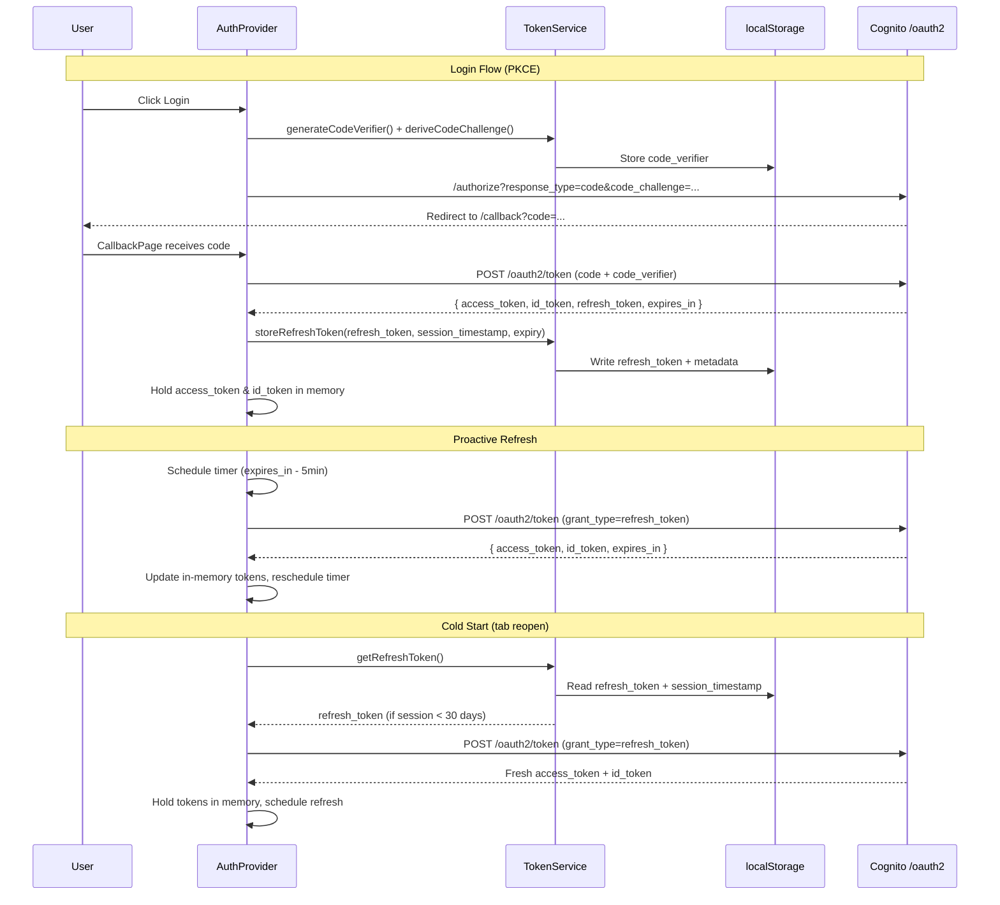
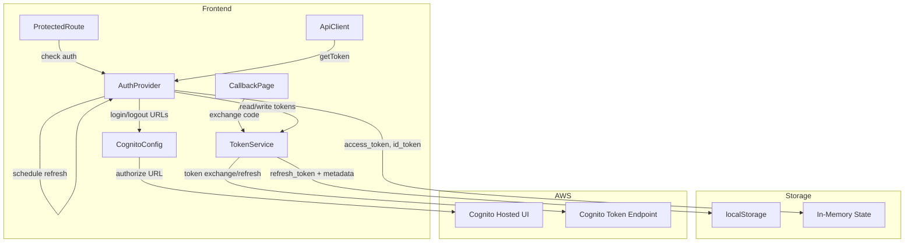

# Design Document: Cognito Session Caching

## Overview

This design transforms the famtrac-frontend authentication layer from the OAuth implicit flow with sessionStorage to the Authorization Code flow with PKCE using localStorage-backed persistent sessions. The change gives users sessions that survive tab closures and browser restarts for up to 30 days, while improving security by eliminating access tokens from URLs and keeping short-lived tokens in memory only.

The scope covers five areas:
1. PKCE-based Authorization Code flow (login URL generation, code exchange on callback)
2. Persistent token storage with a split strategy (refresh token in localStorage, access/ID tokens in memory)
3. Proactive token refresh with retry logic
4. 30-day session lifetime enforcement
5. CDK infrastructure update (remove client secret, drop implicit flow)

## Architecture



### Component Interaction



## Components and Interfaces

### 1. TokenService (`tokenService.ts`)

The token service is refactored from a simple sessionStorage wrapper into a split-storage manager. It owns all localStorage I/O and PKCE helper functions.

```typescript
// --- Constants ---
const AUTH_KEY_PREFIX = 'famtrac_auth_';
const REFRESH_TOKEN_KEY = `${AUTH_KEY_PREFIX}refresh_token`;
const TOKEN_EXPIRY_KEY = `${AUTH_KEY_PREFIX}token_expiry`;
const SESSION_TIMESTAMP_KEY = `${AUTH_KEY_PREFIX}session_timestamp`;
const CODE_VERIFIER_KEY = `${AUTH_KEY_PREFIX}code_verifier`;

const SESSION_LIFETIME_MS = 30 * 24 * 60 * 60 * 1000; // 30 days

// --- PKCE Helpers ---
function generateCodeVerifier(): string;
  // Returns a 128-char random string from crypto.getRandomValues()

function deriveCodeChallenge(verifier: string): Promise<string>;
  // SHA-256 hash of verifier, base64url-encoded

function storeCodeVerifier(verifier: string): void;
  // localStorage.setItem(CODE_VERIFIER_KEY, verifier)

function getAndClearCodeVerifier(): string | null;
  // Read + remove CODE_VERIFIER_KEY from localStorage

// --- Token Exchange ---
async function exchangeCodeForTokens(code: string): Promise<CognitoTokens | null>;
  // POST /oauth2/token with grant_type=authorization_code, code, code_verifier, redirect_uri, client_id

// --- Persistent Storage (refresh token + metadata only) ---
function storeRefreshToken(refreshToken: string, expiresIn: number): void;
  // Writes REFRESH_TOKEN_KEY, TOKEN_EXPIRY_KEY
  // Writes SESSION_TIMESTAMP_KEY only if not already present (preserve across refreshes)

function getRefreshToken(): string | null;
  // Returns refresh token if session is within 30-day lifetime, else clears and returns null

function getTokenExpiry(): number | null;
  // Returns stored expiry timestamp

function isSessionExpired(): boolean;
  // Checks SESSION_TIMESTAMP_KEY against SESSION_LIFETIME_MS

// --- Refresh ---
async function refreshAccessToken(refreshToken: string): Promise<CognitoTokens | null>;
  // POST /oauth2/token with grant_type=refresh_token (existing logic, unchanged)

// --- Cleanup ---
function clearTokens(): void;
  // Removes all keys with AUTH_KEY_PREFIX from localStorage
```

Key changes from current implementation:
- `sessionStorage` → `localStorage` for refresh token and metadata
- Access/ID tokens are no longer written to storage; they live in AuthProvider state
- `parseTokensFromUrl()` is removed (no more hash-based token extraction)
- PKCE helpers added (`generateCodeVerifier`, `deriveCodeChallenge`)
- `exchangeCodeForTokens()` added for authorization code exchange
- Session timestamp tracking added with 30-day enforcement
- All keys use `famtrac_auth_` prefix for clean bulk removal

### 2. CognitoConfig (`cognito.ts`)

```typescript
// buildLoginUrl changes:
// - response_type changes from 'token' to 'code'
// - Adds code_challenge and code_challenge_method=S256 parameters
// - Generates and stores code_verifier before building URL
export async function buildLoginUrl(): Promise<string>;
  // Now async because deriveCodeChallenge uses SubtleCrypto

// buildLogoutUrl: unchanged
export function buildLogoutUrl(): string;
```

The function signature changes from sync to async because `SubtleCrypto.digest()` returns a Promise.

### 3. AuthProvider (`AuthProvider.tsx`)

```typescript
// New state:
// - accessToken: string | null (in-memory only)
// - idToken: string | null (in-memory only)
// - refreshTimerId: NodeJS.Timeout | null (for cleanup)

// Initialization flow changes:
// 1. Check for stored refresh token (not access token)
// 2. Verify session timestamp < 30 days
// 3. If valid, call refreshAccessToken() to get fresh access/ID tokens
// 4. Store access/ID tokens in React state (memory only)
// 5. Schedule proactive refresh

// Proactive refresh:
// - scheduleRefresh(expiresIn): sets timer for (expiresIn - 300) seconds
// - On timer fire: call refreshAccessToken()
// - On success: update in-memory tokens, store new refresh metadata, reschedule
// - On failure: retry once after 30 seconds
// - On retry failure: clearTokens() + redirect to login

// login() becomes async (because buildLoginUrl is now async)

// logout():
// - clearTokens() (removes all localStorage keys)
// - Redirect to Cognito logout endpoint (buildLogoutUrl)

// Cleanup:
// - useEffect cleanup cancels refresh timer on unmount
```

### 4. CallbackPage (`CallbackPage.tsx`)

```typescript
// Changes:
// - Read authorization code from URL query params (not hash)
// - Call tokenService.exchangeCodeForTokens(code)
// - On success: store refresh token + metadata, set in-memory tokens via context/event
// - On failure: clear partial state, redirect to home
// - Remove parseTokensFromUrl() usage
```

The callback page switches from parsing hash fragments to reading `?code=` from the query string and performing a server-side token exchange.

### 5. CDK Auth Stack (`FamtracAuthorization.ts`)

```typescript
// Changes to UserPoolClient configuration:
// - generateSecret: false (was true)
// - Remove implicitCodeGrant: true from oAuth.flows
// - Keep authorizationCodeGrant: true
// - Keep all token validity settings unchanged
// - Keep existing callbackUrls using /login path (unchanged)
```

### 6. ApiClient (`client.ts`)

No structural changes needed. The `getAuthToken` callback already delegates to `AuthProvider.getToken()`, which will now return the in-memory access token and handle refresh internally.

## Data Models

### Token Storage Schema (localStorage)

| Key | Value | Lifetime |
|-----|-------|----------|
| `famtrac_auth_refresh_token` | Cognito refresh token string | Until logout or 30-day expiry |
| `famtrac_auth_token_expiry` | Unix timestamp (ms) of access token expiry | Updated on each refresh |
| `famtrac_auth_session_timestamp` | Unix timestamp (ms) of initial login | Set once per session, never updated |
| `famtrac_auth_code_verifier` | PKCE code verifier string | Transient: written before login, consumed on callback |

### In-Memory Token State (AuthProvider)

```typescript
interface InMemoryAuthState {
  accessToken: string | null;
  idToken: string | null;
  user: CognitoUser | null;
  isAuthenticated: boolean;
  isLoading: boolean;
}
```

### CognitoTokens (updated)

```typescript
export interface CognitoTokens {
  access_token: string;
  id_token: string;
  refresh_token?: string;
  expires_in: number;
  token_type?: string;
}
```

This interface remains unchanged — the token exchange endpoint returns the same shape. The difference is that `refresh_token` will now always be present on initial login (authorization code flow returns it), while refresh grant responses omit it (Cognito behavior).

### Token Exchange Request

```typescript
// Authorization code exchange
{
  grant_type: 'authorization_code',
  client_id: string,
  code: string,
  code_verifier: string,
  redirect_uri: string
}

// Refresh token exchange (unchanged)
{
  grant_type: 'refresh_token',
  client_id: string,
  refresh_token: string
}
```


## Correctness Properties

*A property is a characteristic or behavior that should hold true across all valid executions of a system — essentially, a formal statement about what the system should do. Properties serve as the bridge between human-readable specifications and machine-verifiable correctness guarantees.*

### Property 1: Login URL uses authorization code flow with PKCE

*For any* valid Cognito configuration, the generated login URL SHALL contain `response_type=code`, a `code_challenge` parameter, and `code_challenge_method=S256`, and SHALL NOT contain `response_type=token`.

**Validates: Requirements 1.1, 1.6**

### Property 2: PKCE code challenge derivation is deterministic

*For any* code verifier string, deriving the code challenge twice with SHA-256 and base64url encoding SHALL produce identical results, and the challenge SHALL differ from the original verifier.

**Validates: Requirements 1.2**

### Property 3: Token exchange request includes required PKCE parameters

*For any* authorization code and stored code verifier, the token exchange request body SHALL contain `grant_type=authorization_code`, the `code`, the `code_verifier`, the `redirect_uri`, and the `client_id`.

**Validates: Requirements 1.3**

### Property 4: Token storage round-trip

*For any* valid refresh token and expires_in value, after calling `storeRefreshToken()`, reading back from localStorage SHALL return the same refresh token, a token expiry timestamp equal to the storage time plus `expires_in * 1000`, and a session timestamp approximately equal to the time of the first store call.

**Validates: Requirements 2.1, 2.2, 2.6, 5.3**

### Property 5: Session lifetime enforcement

*For any* session timestamp, `getRefreshToken()` SHALL return the stored refresh token if and only if the session timestamp is within 30 days of the current time. If the session is older than 30 days, `getRefreshToken()` SHALL return null and all auth keys SHALL be removed from localStorage.

**Validates: Requirements 2.3, 2.4, 5.1**

### Property 6: Refresh preserves session timestamp

*For any* initial session timestamp and any number of subsequent `storeRefreshToken()` calls (simulating token refreshes), the session timestamp in localStorage SHALL remain equal to the original value set during the first store call.

**Validates: Requirements 2.5**

### Property 7: Proactive refresh scheduling

*For any* `expires_in` value greater than 300 seconds, the proactive refresh timer SHALL be scheduled at `(expires_in - 300) * 1000` milliseconds. For `expires_in` values of 300 seconds or less, the refresh SHALL be scheduled immediately.

**Validates: Requirements 4.1**

### Property 8: Logout clears all authentication keys

*For any* set of authentication-related data stored in localStorage (refresh token, session timestamp, token expiry, code verifier), after calling `clearTokens()`, no keys with the `famtrac_auth_` prefix SHALL remain in localStorage.

**Validates: Requirements 6.1, 7.3**

### Property 9: localStorage never contains access or ID tokens

*For any* token storage operation performed by the TokenService, localStorage SHALL NOT contain keys storing access tokens or ID tokens. Only the refresh token and metadata (expiry, session timestamp) SHALL be persisted.

**Validates: Requirements 7.1**

### Property 10: All authentication keys use consistent prefix

*For any* key written to localStorage by the TokenService, the key SHALL start with the `famtrac_auth_` prefix.

**Validates: Requirements 7.4**

## Error Handling

| Scenario | Handling |
|----------|----------|
| Token exchange fails (network error or non-200) | `exchangeCodeForTokens` returns `null`. CallbackPage clears partial state via `clearTokens()` and redirects to `/`. |
| Token exchange returns malformed JSON | Caught by try/catch in `exchangeCodeForTokens`, returns `null`. Same cleanup path. |
| Refresh token grant fails (first attempt) | AuthProvider retries once after 30-second delay. |
| Refresh token grant fails (retry) | AuthProvider calls `clearTokens()`, sets `isAuthenticated = false`, redirects to Cognito login. |
| Session timestamp older than 30 days | `getRefreshToken()` returns `null` and clears all auth keys. AuthProvider treats this as unauthenticated and redirects to login. |
| localStorage unavailable or full | Token storage operations will throw. Caught by try/catch wrappers; user falls back to re-login on next visit. |
| PKCE code verifier missing on callback | `getAndClearCodeVerifier()` returns `null`. `exchangeCodeForTokens` fails, CallbackPage redirects to `/`. |
| 401 from API | ApiClient dispatches `auth:expired` event (existing behavior). AuthProvider listener calls `clearTokens()` and redirects to login. |
| Corrupt data in localStorage | JSON.parse failures caught in try/catch, return `null`. Triggers re-authentication flow. |
| SubtleCrypto unavailable (non-HTTPS) | `deriveCodeChallenge` will reject. Login flow fails gracefully — user sees an error. This only affects non-HTTPS environments which are dev-only. |

## Testing Strategy

### Testing Framework

- Unit and property tests: **Vitest** (already configured)
- Property-based testing library: **fast-check** (already in devDependencies)
- DOM testing: **@testing-library/react** (already in devDependencies)

### Unit Tests

Unit tests cover specific examples, edge cases, and integration points:

- **TokenService**: Store/retrieve round-trip with specific values, clearTokens removes all keys, expired session returns null, PKCE verifier generation produces valid length/characters
- **CognitoConfig**: Login URL contains correct query parameters for a known config, logout URL is unchanged
- **CallbackPage**: Successful code exchange stores tokens and redirects, failed exchange clears state and redirects to home, missing code parameter redirects to home
- **AuthProvider**: Initialization with valid refresh token sets authenticated state, initialization with expired session redirects to login, logout clears storage and redirects to Cognito logout, auth:expired event triggers cleanup, unmount cancels refresh timer
- **CDK Auth Stack**: Snapshot or assertion test that `generateSecret` is `false`, `implicitCodeGrant` is absent, `authorizationCodeGrant` is `true`

### Property-Based Tests

Each correctness property maps to a single property-based test using `fast-check`. All property tests run a minimum of 100 iterations.

Each test is tagged with a comment in the format:
**Feature: cognito-session-caching, Property {number}: {property_text}**

| Property | Test Strategy | Generator |
|----------|--------------|-----------|
| P1: Login URL format | Generate random domain/clientId/redirectUri/scope strings, build URL, assert query params | `fc.record({ domain: fc.string(), clientId: fc.string(), ... })` |
| P2: PKCE derivation determinism | Generate random verifier strings, derive challenge twice, assert equality and challenge ≠ verifier | `fc.string({ minLength: 43, maxLength: 128 })` |
| P3: Token exchange request params | Generate random code + verifier strings, assert request body contains all required fields | `fc.record({ code: fc.string(), verifier: fc.string() })` |
| P4: Storage round-trip | Generate random refresh token strings and expires_in numbers, store then read, assert equality | `fc.record({ token: fc.string({ minLength: 1 }), expiresIn: fc.integer({ min: 1 }) })` |
| P5: Session lifetime | Generate random timestamps (some within 30 days, some beyond), set in localStorage, assert getRefreshToken behavior | `fc.integer()` mapped to timestamps relative to now |
| P6: Refresh preserves timestamp | Generate initial token + N refresh tokens, store sequentially, assert session timestamp unchanged | `fc.array(fc.string({ minLength: 1 }), { minLength: 1 })` |
| P7: Refresh scheduling | Generate random expires_in values, assert timer delay is `max(0, (expiresIn - 300)) * 1000` | `fc.integer({ min: 1, max: 86400 })` |
| P8: Logout cleanup | Generate random sets of auth keys, store them, call clearTokens, assert no prefixed keys remain | `fc.record(...)` of optional auth values |
| P9: No access/ID in localStorage | Generate random CognitoTokens, call storeRefreshToken, scan all localStorage keys for access/id tokens | `fc.record({ access_token: fc.string(), id_token: fc.string(), refresh_token: fc.string(), expires_in: fc.integer({ min: 1 }) })` |
| P10: Key prefix consistency | Generate random tokens, store them, assert every auth-related key starts with `famtrac_auth_` | `fc.string({ minLength: 1 })` |
