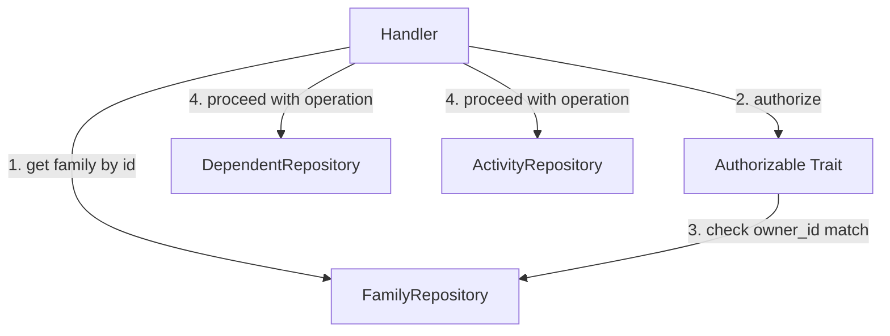
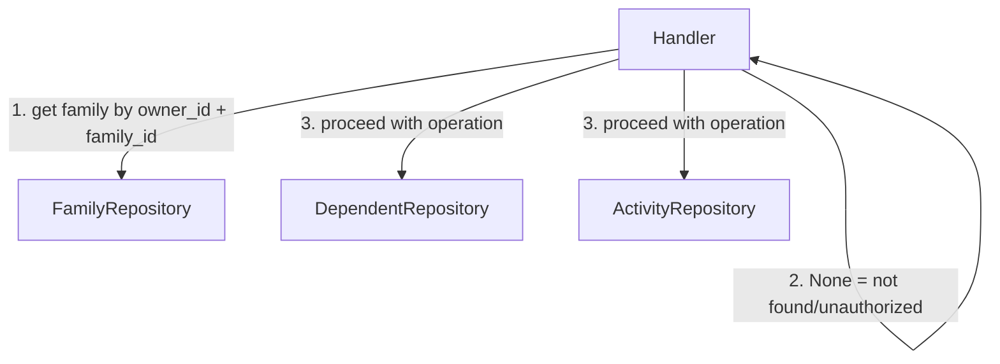

# Design Document: DynamoDB Tenant Isolation

## Overview

This design refactors the DynamoDB key schema and repository layer in the famtrac-backend to enforce tenant isolation structurally rather than through application-level authorization checks. The core change moves the Family table from `PK=FAMILY#{family_id}, SK=METADATA` to `PK=OWNER#{owner_id}, SK=FAMILY#{family_id}`, embedding the owner identity into the partition key. This makes cross-tenant access impossible at the data layer — you simply cannot construct the correct key without the owner context.

The Activity table sort key changes from a timestamp-composite (`ACTIVITY#{timestamp}#{activity_id}`) to a UUID-based sort key (`ACTIVITY#{activity_id}`), enabling direct GetItem/DeleteItem calls. A new GSI provides chronological ordering for time-range queries.

The `Authorizable` trait and its implementations are removed. Authorization becomes implicit: if `FamilyRepository::get(owner_id, family_id)` returns `Some(family)`, the caller is authorized. If it returns `None`, they're not.

## Architecture

### Current State



- Family table: `PK=FAMILY#{family_id}, SK=METADATA`
- Owner lookup uses GSI-1 on `owner_id`
- Authorization is a separate step via `Authorizable::authorize()`
- Activity get/delete requires a query + filter (timestamp in SK makes direct lookup impossible)

### Target State



- Family table: `PK=OWNER#{owner_id}, SK=FAMILY#{family_id}`
- Owner lookup is a native partition query (no GSI needed)
- Authorization is implicit in the key structure
- Activity get/delete uses direct GetItem/DeleteItem with `SK=ACTIVITY#{activity_id}`
- Activity time-range queries use a new GSI with timestamp sort key

### Key Schema Changes Summary

| Entity | Current PK | Current SK | New PK | New SK |
|--------|-----------|-----------|--------|--------|
| Family | `FAMILY#{fid}` | `METADATA` | `OWNER#{owner_id}` | `FAMILY#{fid}` |
| Dependent | `FAMILY#{fid}` | `DEPENDENT#{did}` | *(unchanged)* | *(unchanged)* |
| Activity | `FAMILY#{fid}#DEPENDENT#{did}` | `ACTIVITY#{ts}#{aid}` | *(unchanged PK)* | `ACTIVITY#{aid}` |

### Activity GSI

| Attribute | Value |
|-----------|-------|
| GSI Name | `Activity-Timestamp-GSI` |
| GSI PK | `PK` (same as table: `FAMILY#{fid}#DEPENDENT#{did}`) |
| GSI SK | `timestamp` (ISO 8601 string) |
| Projection | ALL |

## Components and Interfaces

### FamilyRepository Trait (Changed)

```rust
#[async_trait]
pub trait FamilyRepository: Send + Sync {
    async fn create(&self, family: Family) -> Result<Family, StoreError>;
    async fn get(&self, owner_id: IdentityId, id: FamilyId) -> Result<Option<Family>, StoreError>;
    async fn update(&self, family: Family) -> Result<Family, StoreError>;
    async fn get_by_owner(&self, owner_id: IdentityId) -> Result<Vec<Family>, StoreError>;
}
```

Changes:
- `get()` now requires `owner_id: IdentityId` as the first parameter
- `create()` and `update()` signatures unchanged (they derive PK from `family.owner_id`)
- `get_by_owner()` signature unchanged but implementation switches from GSI-1 query to main table partition query

### DependentRepository Trait (Unchanged)

No changes. Dependent key schema is preserved as-is.

### ActivityRepository Trait (Unchanged Signatures)

The trait signatures remain the same. The implementation changes:
- `get()` switches from query+filter to direct GetItem using `SK=ACTIVITY#{activity_id}`
- `delete()` switches from query-then-delete to direct DeleteItem using `SK=ACTIVITY#{activity_id}`
- `query()` switches from main table query with filter expressions to GSI query with key conditions on timestamp

### DynamoDbFamilyRepository (Changed)

```rust
// to_item: PK=OWNER#{owner_id}, SK=FAMILY#{family_id}
// get: GetItem with PK=OWNER#{owner_id}, SK=FAMILY#{family_id}
// get_by_owner: Query on PK=OWNER#{owner_id} with SK begins_with("FAMILY#")
// create: PutItem with PK derived from family.owner_id
// update: PutItem with PK derived from family.owner_id
```

### DynamoDbActivityRepository (Changed)

```rust
// to_item: SK changes from ACTIVITY#{timestamp}#{id} to ACTIVITY#{id}
//          timestamp stored as a separate attribute (for GSI SK)
// get: GetItem with PK=FAMILY#{fid}#DEPENDENT#{did}, SK=ACTIVITY#{aid}
// delete: DeleteItem with PK=FAMILY#{fid}#DEPENDENT#{did}, SK=ACTIVITY#{aid}
// query: Query on Activity-Timestamp-GSI with PK and timestamp range conditions
```

### Handler Changes

All handlers that currently call `Authorizable::authorize()` will instead rely on the `FamilyRepository::get(owner_id, family_id)` call returning `None` for unauthorized access. The `DependentRepository` generic parameter can be removed from family handlers since it was only needed for the `Authorizable` trait.

| Handler | Current Pattern | New Pattern |
|---------|----------------|-------------|
| `get_family` | `repo.get(fid)` → `family.authorize(...)` | `repo.get(owner_id, fid)` → None = 404 |
| `update_family` | `repo.get(fid)` → `family.authorize(...)` | `repo.get(owner_id, fid)` → None = 404 |
| `create_dependent` | `family_repo.get(fid)` → `family.authorize(...)` | `family_repo.get(owner_id, fid)` → None = 404 |
| `get_dependent` | `family_repo.get(fid)` → `family.authorize(...)` | `family_repo.get(owner_id, fid)` → None = 404 |
| `list_dependents` | `family_repo.get(fid)` → `family.authorize(...)` | `family_repo.get(owner_id, fid)` → None = 404 |
| `update_dependent` | `family_repo.get(fid)` → `family.authorize(...)` | `family_repo.get(owner_id, fid)` → None = 404 |
| `delete_dependent` | `family_repo.get(fid)` → `family.authorize(...)` | `family_repo.get(owner_id, fid)` → None = 404 |
| Activity handlers | `family_repo.get(fid)` → `family.authorize(...)` | `family_repo.get(owner_id, fid)` → None = 404 |

### Authorization Module

The `Authorizable` trait and all its implementations (`Family`, `Dependent`, `Activity`) are removed. The `authorization.rs` file can be deleted or emptied. Tests that validated the `Authorizable` trait are removed; equivalent coverage is provided by handler tests that verify 404 behavior for mismatched owner contexts.

## Data Models

### Family Record (DynamoDB)

| Attribute | Type | Value |
|-----------|------|-------|
| PK | S | `OWNER#{owner_id}` |
| SK | S | `FAMILY#{family_id}` |
| Type | S | `Family` |
| id | S | `{family_id}` |
| name | S | `{name}` |
| owner_id | S | `{owner_id}` |
| created_at | S | ISO 8601 timestamp |
| updated_at | S | ISO 8601 timestamp |

### Dependent Record (Unchanged)

| Attribute | Type | Value |
|-----------|------|-------|
| PK | S | `FAMILY#{family_id}` |
| SK | S | `DEPENDENT#{dependent_id}` |
| *(remaining attributes unchanged)* | | |

### Activity Record (DynamoDB)

| Attribute | Type | Value |
|-----------|------|-------|
| PK | S | `FAMILY#{family_id}#DEPENDENT#{dependent_id}` |
| SK | S | `ACTIVITY#{activity_id}` |
| Type | S | `Activity` |
| id | S | `{activity_id}` |
| family_id | S | `{family_id}` |
| dependent_id | S | `{dependent_id}` |
| timestamp | S | ISO 8601 timestamp |
| created_at | S | ISO 8601 timestamp |
| updated_at | S | ISO 8601 timestamp |
| activity_type | S | JSON-serialized ActivityType |
| activity_type_name | S | `feeding` / `diaper_change` / `sleep` / `pumping` |

### Activity-Timestamp-GSI

| GSI Attribute | Source |
|---------------|--------|
| PK (partition) | Table PK (`FAMILY#{fid}#DEPENDENT#{did}`) |
| SK (sort) | `timestamp` attribute |
| Projection | ALL |

### Domain Structs (Unchanged)

The Rust domain structs (`Family`, `Dependent`, `Activity`, `ActivityType`) remain unchanged. Only the repository layer and DynamoDB key construction change.

## Correctness Properties

*A property is a characteristic or behavior that should hold true across all valid executions of a system — essentially, a formal statement about what the system should do. Properties serve as the bridge between human-readable specifications and machine-verifiable correctness guarantees.*

### Property 1: Family key construction

*For any* Family with any `owner_id` and `family_id`, the `to_item` method SHALL produce a DynamoDB item where `PK` equals `OWNER#{owner_id}` and `SK` equals `FAMILY#{family_id}`.

**Validates: Requirements 1.1, 1.2, 1.5, 3.3, 3.4**

### Property 2: Family tenant isolation

*For any* Family stored under owner A, calling `FamilyRepository::get(owner_B, family_id)` where `owner_B != owner_A` SHALL return `None`. Equivalently, `get` returns `Some(family)` only when the provided `owner_id` matches the family's actual owner.

**Validates: Requirements 1.6, 3.2, 6.2**

### Property 3: Activity key construction

*For any* Activity with any `family_id`, `dependent_id`, and `activity_id`, the `to_item` method SHALL produce a DynamoDB item where `PK` equals `FAMILY#{family_id}#DEPENDENT#{dependent_id}` and `SK` equals `ACTIVITY#{activity_id}` (UUID only, no timestamp in SK).

**Validates: Requirements 2.1**

### Property 4: Activity query timestamp ordering

*For any* set of activities stored for a given family+dependent partition, querying via `ActivityRepository::query` SHALL return results sorted by timestamp in descending order (most recent first).

**Validates: Requirements 2.6**

### Property 5: Handler owner context propagation

*For any* handler that accesses a Family (get_family, update_family, create_dependent, get_dependent, list_dependents, delete_dependent, and all activity handlers), the handler SHALL pass the `RequestContext.identity_id` as the `owner_id` parameter to `FamilyRepository::get`. A family owned by identity A is not accessible when the request context contains identity B.

**Validates: Requirements 4.1, 4.2, 4.3, 4.4, 4.5, 4.6**

### Property 6: Unauthorized access yields 404

*For any* handler and any family owned by identity A, when the `RequestContext` contains identity B (where B != A), the handler SHALL return a 404 Not Found response (not a 403 Forbidden), and no data from the family or its children shall be returned.

**Validates: Requirements 5.2, 5.3**

## Error Handling

### Repository Layer

| Scenario | Current Behavior | New Behavior |
|----------|-----------------|--------------|
| Family get with wrong owner | Returns `Some(family)` (then authorize fails) | Returns `None` |
| Family get with correct owner, non-existent id | Returns `None` | Returns `None` (unchanged) |
| Activity get by id | Query + filter (may return empty) | GetItem (returns None if not found) |
| Activity delete by id | Query first, then delete (NotFound error if query empty) | Direct DeleteItem (silent if not found) |
| DynamoDB SDK errors | `StoreError::QueryError` | `StoreError::QueryError` (unchanged) |

### Handler Layer

- Handlers no longer distinguish between "not found" and "unauthorized" for family access. Both cases return 404. This is intentional — it prevents information leakage about whether a family exists under a different owner.
- The `AuthError::Forbidden` variant is no longer produced by family/dependent/activity handlers. It may still be used for other authorization scenarios if needed.
- `HandlerError::Auth(AuthError::Forbidden(_))` test assertions change to `HandlerError::NotFound(_)` assertions.

### Migration Considerations

- Existing data must be migrated from `PK=FAMILY#{fid}, SK=METADATA` to `PK=OWNER#{owner_id}, SK=FAMILY#{fid}`. This requires a one-time migration script.
- Activity records must be migrated from `SK=ACTIVITY#{timestamp}#{id}` to `SK=ACTIVITY#{id}`. The `timestamp` attribute already exists as a separate field.
- The GSI-1 on the Family table can be removed after migration.
- The Activity-Timestamp-GSI must be created before deploying the new query code.

## Testing Strategy

### Property-Based Testing

Use the `proptest` crate for property-based testing in Rust. Each property test should run a minimum of 100 iterations.

Each property-based test must be tagged with a comment referencing the design property:
```rust
// Feature: dynamodb-tenant-isolation, Property 1: Family key construction
```

Property tests target the repository layer (key construction, isolation behavior) and handler layer (owner propagation, 404 behavior). They use the `MockFamilyRepository`, `MockDependentRepository`, and `MockActivityRepository` from `test_utils.rs`.

| Property | Test Approach |
|----------|--------------|
| Property 1: Family key construction | Generate random `owner_id` and `family_id` strings, construct a `Family`, call `to_item`, assert PK/SK format |
| Property 2: Family tenant isolation | Generate random families with random owners, store them, attempt `get` with a different random owner, assert `None` |
| Property 3: Activity key construction | Generate random activity fields, call `to_item`, assert PK contains family+dependent and SK is `ACTIVITY#{uuid}` only |
| Property 4: Activity query ordering | Generate random activities with random timestamps, store them, query, assert descending timestamp order |
| Property 5: Handler owner context propagation | Generate random identity pairs (owner vs requester), run handler with mock repo, verify correct owner_id was used in get call |
| Property 6: Unauthorized access yields 404 | Generate random families with owner A, call handlers with identity B, assert 404 response |

### Unit Testing

Unit tests complement property tests by covering specific examples and edge cases:

- Family CRUD operations with correct owner context (happy path examples)
- Activity CRUD with the new key schema (happy path examples)
- Handler tests for each endpoint verifying the new authorization flow
- Edge cases: empty owner_id, empty family_id, special characters in IDs
- Mock repository behavior: verify mock correctly enforces owner matching
- Removal verification: ensure no references to `Authorizable` trait remain in handler code

### Integration Testing

- End-to-end tests against DynamoDB Local verifying:
  - Family creation and retrieval with owner-scoped keys
  - Cross-tenant isolation (owner A cannot read owner B's families)
  - Activity GSI queries return correct chronological ordering
  - Activity direct GetItem/DeleteItem work with UUID-based SK
  - Migration script correctness (old format → new format)
