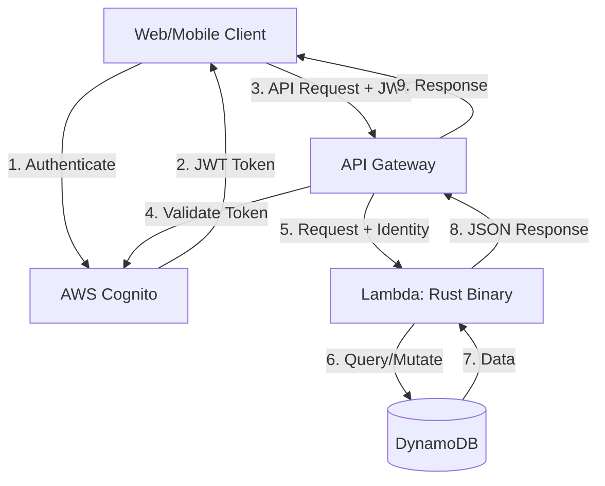

# Design Document: famtrac-backend

## Overview

The famtrac-backend is a REST API service built with Rust and deployed on AWS Lambda, designed to enable caregivers to coordinate and track daily activities for dependents (primarily infants). The system organizes around three core resources: Family, Dependent, and Activity.

The architecture leverages AWS managed services to minimize operational complexity:
- **AWS Cognito** handles user authentication and identity management
- **API Gateway** provides HTTP routing and authorization via Cognito authorizers
- **AWS Lambda** hosts the Rust binary that implements the business logic
- **DynamoDB** serves as the persistent data store for multi-tenant data

The API trusts authenticated identities provided by API Gateway, enabling multi-tenancy through identity-based access control. Each Family resource is owned by the creating identity, and all access to Family, Dependent, and Activity resources is scoped by this ownership model.

### Key Design Goals

1. **Simplicity**: Leverage AWS managed services to reduce custom authentication/authorization code
2. **Minimal Surface Area**: Three core resources provide flexibility for future expansion
3. **Multi-Tenancy**: Identity-based isolation ensures data privacy between families
4. **Type Safety**: Rust's type system enforces correctness at compile time
5. **Future Extensibility**: Architecture supports future family sharing and permission models

## Architecture

### System Components



### Request Flow

1. **Authentication**: Client authenticates with AWS Cognito and receives a JWT token
2. **API Request**: Client sends HTTP request to API Gateway with JWT in Authorization header
3. **Authorization**: API Gateway validates JWT with Cognito and extracts identity information
4. **Request Context**: API Gateway forwards request to Lambda with identity context
5. **Business Logic**: Lambda handler extracts identity, validates authorization, and processes request
6. **Data Access**: Lambda queries or mutates DynamoDB based on business logic
7. **Response**: Lambda returns JSON response through API Gateway to client

### Technology Stack

- **Runtime**: Rust (stable)
- **Web Framework**: AWS Lambda Rust Runtime with API Gateway proxy integration
- **Serialization**: serde + serde_json for JSON handling
- **Data Store**: AWS DynamoDB with single-table design
- **Authentication**: AWS Cognito User Pools
- **API Gateway**: HTTP API with JWT authorizer

### Deployment Model

The Rust binary is compiled to a Linux x86_64 target and packaged as a Lambda function. API Gateway routes HTTP requests to the Lambda function using proxy integration, passing the full request context including authenticated identity information.

## Components and Interfaces

### Core Domain Types

#### Family
```rust
struct Family {
    id: FamilyId,           // UUID
    name: String,           // Family name
    owner_id: IdentityId,   // Cognito identity who created the family
    created_at: Timestamp,
    updated_at: Timestamp,
}
```

#### Dependent
```rust
struct Dependent {
    id: DependentId,        // UUID
    family_id: FamilyId,    // Parent family
    name: String,           // Dependent's name
    date_of_birth: Date,
    created_at: Timestamp,
    updated_at: Timestamp,
}
```

#### Activity
```rust
struct Activity {
    id: ActivityId,         // UUID
    dependent_id: DependentId,
    timestamp: Timestamp,   // When activity occurred
    activity_type: ActivityType,
    created_at: Timestamp,  // When record was created
    updated_at: Timestamp,
}

enum ActivityType {
    Feeding { feeding_type: FeedingType, volume_ml: Option<u32> },
    DiaperChange { contents: DiaperContents },
    Sleep { start: Timestamp, end: Timestamp },
    Pumping { volume_ml: u32 },
}

enum FeedingType {
    Breast,
    Bottle,
    Solid,
}

enum DiaperContents {
    Wet,
    Dirty,
    Both,
}
```

### API Endpoints

#### Family Endpoints
- `POST /families` - Create a new family
- `GET /families/{family_id}` - Retrieve family by ID
- `PUT /families/{family_id}` - Update family information

#### Dependent Endpoints
- `POST /dependents` - Create a new dependent
- `GET /dependents/{dependent_id}` - Retrieve dependent by ID
- `PUT /dependents/{dependent_id}` - Update dependent information
- `GET /families/{family_id}/dependents` - List all dependents in a family

#### Activity Endpoints
- `POST /activities` - Create a new activity
- `GET /activities/{activity_id}` - Retrieve activity by ID
- `PUT /activities/{activity_id}` - Update activity
- `DELETE /activities/{activity_id}` - Delete activity
- `GET /dependents/{dependent_id}/activities` - Query activities with filters
  - Query parameters: `start_date`, `end_date`, `activity_type`

### Authorization Model

The API implements a hierarchical authorization model:

1. **Identity Extraction**: Extract Cognito identity from API Gateway request context
2. **Resource Ownership**: Verify identity owns the Family associated with the requested resource
3. **Hierarchical Access**: 
   - Family access grants access to all Dependents in that Family
   - Dependent access grants access to all Activities for that Dependent

```rust
struct RequestContext {
    identity_id: IdentityId,
    // Other request metadata
}

trait Authorizable {
    fn authorize(&self, identity: &IdentityId, store: &DataStore) -> Result<(), AuthError>;
}
```

For the MVP, authorization is simple: the identity that created a Family has full access to that Family and all its dependents and activities. Future iterations will support sharing with fine-grained permissions.

### Data Store Interface

The system uses a repository pattern to abstract DynamoDB operations:

```rust
trait FamilyRepository {
    fn create(&self, family: Family) -> Result<Family, StoreError>;
    fn get(&self, id: FamilyId) -> Result<Option<Family>, StoreError>;
    fn update(&self, family: Family) -> Result<Family, StoreError>;
    fn get_by_owner(&self, owner_id: IdentityId) -> Result<Vec<Family>, StoreError>;
}

trait DependentRepository {
    fn create(&self, dependent: Dependent) -> Result<Dependent, StoreError>;
    fn get(&self, id: DependentId) -> Result<Option<Dependent>, StoreError>;
    fn update(&self, dependent: Dependent) -> Result<Dependent, StoreError>;
    fn list_by_family(&self, family_id: FamilyId) -> Result<Vec<Dependent>, StoreError>;
}

trait ActivityRepository {
    fn create(&self, activity: Activity) -> Result<Activity, StoreError>;
    fn get(&self, id: ActivityId) -> Result<Option<Activity>, StoreError>;
    fn update(&self, activity: Activity) -> Result<Activity, StoreError>;
    fn delete(&self, id: ActivityId) -> Result<(), StoreError>;
    fn query(&self, params: ActivityQueryParams) -> Result<Vec<Activity>, StoreError>;
}

struct ActivityQueryParams {
    dependent_id: DependentId,
    start_date: Option<Date>,
    end_date: Option<Date>,
    activity_type: Option<ActivityType>,
}
```

### Handler Architecture

Each endpoint is implemented as a handler function that follows this pattern:

1. **Parse Request**: Deserialize JSON body and extract path/query parameters
2. **Extract Identity**: Get authenticated identity from request context
3. **Validate Input**: Check business rules and constraints
4. **Authorize**: Verify identity has access to requested resources
5. **Execute**: Perform business logic and data store operations
6. **Serialize Response**: Convert result to JSON and return appropriate HTTP status

```rust
async fn create_family_handler(
    event: Request,
    context: RequestContext,
) -> Result<Response, HandlerError> {
    // 1. Parse request
    let request: CreateFamilyRequest = parse_body(&event)?;
    
    // 2. Extract identity
    let identity_id = context.identity_id;
    
    // 3. Validate input
    validate_family_name(&request.name)?;
    
    // 4. Create family (authorization implicit - creator is owner)
    let family = Family {
        id: FamilyId::new(),
        name: request.name,
        owner_id: identity_id,
        created_at: Timestamp::now(),
        updated_at: Timestamp::now(),
    };
    
    // 5. Execute
    let created = family_repo.create(family)?;
    
    // 6. Serialize response
    Ok(json_response(201, created))
}
```

## Data Models

### DynamoDB Single-Table Design

The system uses a single DynamoDB table with the following key structure:

| PK | SK | Type | Attributes |
|----|----|----|------------|
| `FAMILY#{family_id}` | `METADATA` | Family | name, owner_id, created_at, updated_at |
| `FAMILY#{family_id}` | `DEPENDENT#{dependent_id}` | Dependent | name, date_of_birth, created_at, updated_at |
| `DEPENDENT#{dependent_id}` | `ACTIVITY#{timestamp}#{activity_id}` | Activity | activity_type, type_specific_attrs, created_at, updated_at |
| `OWNER#{owner_id}` | `FAMILY#{family_id}` | OwnerIndex | (for listing families by owner) |

**Access Patterns**:
1. Get Family by ID: Query PK=`FAMILY#{family_id}`, SK=`METADATA`
2. List Dependents by Family: Query PK=`FAMILY#{family_id}`, SK begins_with `DEPENDENT#`
3. Query Activities by Dependent: Query PK=`DEPENDENT#{dependent_id}`, SK begins_with `ACTIVITY#`, with range conditions on timestamp
4. List Families by Owner: Query GSI on owner_id

**Indexes**:
- **Primary Key**: PK (partition key), SK (sort key)
- **GSI-1**: owner_id (partition key), created_at (sort key) - for listing families by owner

### Data Validation Rules

#### Family
- `name`: Required, 1-100 characters, non-empty after trimming

#### Dependent
- `name`: Required, 1-100 characters, non-empty after trimming
- `date_of_birth`: Required, must not be in the future
- `family_id`: Required, must reference an existing Family

#### Activity
- `dependent_id`: Required, must reference an existing Dependent
- `timestamp`: Required, must not be in the future
- `activity_type`: Required, must be one of the supported types with valid type-specific attributes

**Type-Specific Validation**:
- **Feeding**: `feeding_type` required, `volume_ml` optional but if present must be > 0
- **DiaperChange**: `contents` required
- **Sleep**: `start` and `end` required, `end` must be after `start`
- **Pumping**: `volume_ml` required and must be > 0

### Timestamp Handling

All timestamps are stored as ISO 8601 strings in UTC. The system uses the following timestamp fields:
- `created_at`: Set once when resource is created, never modified
- `updated_at`: Updated on every modification
- `timestamp` (Activity only): When the activity occurred (user-provided, validated to not be in future)

### Error Response Format

All error responses follow a consistent JSON structure:

```json
{
  "error": {
    "code": "VALIDATION_ERROR",
    "message": "Descriptive error message",
    "details": {
      "field": "name",
      "constraint": "must be between 1 and 100 characters"
    }
  }
}
```

**Error Codes**:
- `VALIDATION_ERROR`: Input validation failed (400)
- `NOT_FOUND`: Requested resource does not exist (404)
- `UNAUTHORIZED`: Missing or invalid authentication (401)
- `FORBIDDEN`: Authenticated but not authorized for resource (403)
- `INTERNAL_ERROR`: Unexpected server error (500)

## Future Extensibility

### Family Sharing and Permissions

While the MVP implements a simple single-owner model, the architecture is designed to support future family sharing with fine-grained permissions. The following design decisions enable this future capability:

#### Architectural Enablers

1. **Owner Tracking**: Every Family resource explicitly tracks its `owner_id`, establishing a clear ownership model that can be extended to support multiple authorized users.

2. **Hierarchical Authorization**: The authorization model already implements hierarchical access (Family → Dependent → Activity), which naturally extends to permission inheritance in a sharing model.

3. **Repository Abstraction**: The repository pattern isolates data access logic, making it straightforward to add permission checks without modifying handler code.

4. **Identity-Based Access**: The system already extracts and validates identity for every request, providing the foundation for permission lookups.

#### Future Permission Model

When family sharing is implemented, the system will support:

- **Family-Level Sharing**: Share entire Family with read-only or read-write access
- **Dependent-Level Sharing**: Share specific Dependent (and their activities) with granular access
- **Role-Based Access**: Support roles like Owner, Editor, Viewer, Caregiver (dependent-specific)

#### Data Model Considerations

To support sharing, the following additions would be made:

```rust
// New table for permissions
struct FamilyPermission {
    family_id: FamilyId,
    identity_id: IdentityId,
    permission_level: PermissionLevel,
    granted_by: IdentityId,
    granted_at: Timestamp,
}

enum PermissionLevel {
    Owner,           // Full access, can share with others
    ReadWrite,       // Can view and modify all dependents
    ReadOnly,        // Can view all dependents
    DependentSpecific {
        dependent_id: DependentId,
        can_write: bool,
    },
}
```

**DynamoDB Access Pattern**:
- Query permissions by identity: GSI on `identity_id` to list all families a user has access to
- Query permissions by family: Query PK=`FAMILY#{family_id}`, SK begins_with `PERMISSION#` to list all users with access

#### Authorization Changes

The authorization logic would be extended from:
```rust
// Current: Simple owner check
fn authorize_family_access(identity: &IdentityId, family: &Family) -> Result<()> {
    if family.owner_id == *identity {
        Ok(())
    } else {
        Err(AuthError::Forbidden)
    }
}
```

To:
```rust
// Future: Permission-based check
fn authorize_family_access(
    identity: &IdentityId,
    family: &Family,
    required_level: PermissionLevel,
    permission_repo: &PermissionRepository,
) -> Result<()> {
    // Check if owner
    if family.owner_id == *identity {
        return Ok(());
    }
    
    // Check if has sufficient permission
    let permission = permission_repo.get_permission(family.id, identity)?;
    if permission.level.satisfies(required_level) {
        Ok(())
    } else {
        Err(AuthError::Forbidden)
    }
}
```

The key insight is that the current authorization points (in handlers before data access) remain the same locations where permission checks would be added, minimizing refactoring.


## Correctness Properties

A property is a characteristic or behavior that should hold true across all valid executions of a system—essentially, a formal statement about what the system should do. Properties serve as the bridge between human-readable specifications and machine-verifiable correctness guarantees.

### Property 1: Resource Creation Round-Trip

For any valid Family, Dependent, or Activity, creating the resource and then retrieving it by its ID should return an equivalent resource with the same attributes.

**Validates: Requirements 1.1, 1.3, 2.1, 2.3, 3.1**

### Property 2: Resource Update Persistence

For any existing resource (Family, Dependent, or Activity) and any valid update data, updating the resource and then retrieving it should reflect the updated values.

**Validates: Requirements 1.4, 2.4, 5.1**

### Property 3: Invalid Input Rejection

For any resource creation or update request with invalid data (empty names, names exceeding length limits, future dates of birth, future activity timestamps, invalid type-specific attributes), the API should return a 400 Bad Request error with a descriptive message.

**Validates: Requirements 1.2, 2.2, 3.3, 3.4, 5.2, 7.5, 8.2, 8.3**

### Property 4: Identity-Based Authorization

For any authenticated identity and any resource (Family, Dependent, or Activity), the identity should only be able to access resources where the identity owns the associated Family. Attempts to access resources outside the identity's authorized families should return a 403 Forbidden error.

**Validates: Requirements 1.5, 2.6, 3.5, 4.6, 5.5, 6.4, 12.3, 12.5**

### Property 5: Dependent Listing Completeness

For any Family with a set of Dependents, listing dependents for that Family should return all and only the dependents associated with that Family, with no duplicates or omissions.

**Validates: Requirements 2.5**

### Property 6: Activity Type Support

For any Dependent, the API should successfully create and retrieve activities of all four supported types: Feeding, DiaperChange, Sleep, and Pumping, each with their required type-specific attributes.

**Validates: Requirements 3.2**

### Property 7: Activity Query Date Range Filtering

For any Dependent with activities and any valid date range, querying activities within that range should return all and only activities with timestamps within the specified range (inclusive).

**Validates: Requirements 4.1**

### Property 8: Activity Query Type Filtering

For any Dependent with activities and any activity type filter, querying activities with that type filter should return all and only activities matching that specific type.

**Validates: Requirements 4.2**

### Property 9: Activity Query Sorting

For any activity query result, the activities should be sorted by timestamp in descending order (most recent first), such that for any two consecutive activities in the result, the first has a timestamp greater than or equal to the second.

**Validates: Requirements 4.3**

### Property 10: Invalid Date Range Rejection

For any activity query with an invalid date range (end date before start date, malformed dates), the API should return a 400 Bad Request error with a descriptive message.

**Validates: Requirements 4.5**

### Property 11: Created Timestamp Immutability

For any Activity, updating the activity should preserve the original created_at timestamp while updating the updated_at timestamp. The created_at value after update should equal the created_at value before update.

**Validates: Requirements 5.4**

### Property 12: Activity Deletion Completeness

For any Activity, after deleting the activity, attempting to retrieve it should return a 404 Not Found error, and the activity should not appear in any query results.

**Validates: Requirements 6.1, 6.3**

### Property 13: Feeding Activity Validation

For any Feeding activity, the API should validate that feeding_type is present and is one of the valid enum values (Breast, Bottle, Solid), and if volume_ml is present, it must be greater than zero.

**Validates: Requirements 7.1**

### Property 14: Diaper Change Activity Validation

For any DiaperChange activity, the API should validate that contents is present and is one of the valid enum values (Wet, Dirty, Both).

**Validates: Requirements 7.2**

### Property 15: Sleep Activity Validation

For any Sleep activity, the API should validate that both start and end timestamps are present, and the end timestamp is strictly after the start timestamp.

**Validates: Requirements 7.3**

### Property 16: Pumping Activity Validation

For any Pumping activity, the API should validate that volume_ml is present and is greater than zero.

**Validates: Requirements 7.4**

### Property 17: Malformed JSON Rejection

For any request with malformed JSON in the body, the API should return a 400 Bad Request error with a descriptive message about the parsing failure.

**Validates: Requirements 8.1, 10.2**

### Property 18: Input Sanitization

For any string input containing potentially dangerous characters (SQL injection patterns, script tags, etc.), the API should sanitize the input to prevent injection attacks while preserving legitimate content.

**Validates: Requirements 8.4**

### Property 19: Error Response Format Consistency

For any error condition, the API should return a JSON response containing an "error" object with "code" and "message" fields, and an HTTP status code appropriate to the error type (400 for validation errors, 404 for not found, 401 for unauthorized, 403 for forbidden, 500 for internal errors).

**Validates: Requirements 9.1, 9.2**

### Property 20: Internal Error Opacity

For any unexpected internal error (database failures, unexpected exceptions), the API should return a 500 Internal Server Error with a generic error message that does not expose internal implementation details, stack traces, or sensitive information.

**Validates: Requirements 9.3**

### Property 21: Error Logging

For any error condition, the API should log error details (including stack traces for internal errors) to the logging system for debugging purposes, while returning sanitized errors to clients.

**Validates: Requirements 9.4**

### Property 22: JSON Serialization Round-Trip

For any valid resource object (Family, Dependent, or Activity), serializing the object to JSON and then deserializing it back should produce an equivalent object with all fields preserved.

**Validates: Requirements 10.1, 10.3, 10.4**

### Property 23: ISO 8601 Timestamp Format

For any resource with timestamp fields (created_at, updated_at, Activity.timestamp, Sleep.start, Sleep.end), the JSON representation should use ISO 8601 format (e.g., "2024-01-15T10:30:00Z").

**Validates: Requirements 10.5**

### Property 24: CORS Headers Presence

For any API response, the response should include the required CORS headers: Access-Control-Allow-Origin, Access-Control-Allow-Methods, and Access-Control-Allow-Headers.

**Validates: Requirements 11.2, 11.3, 11.4**

### Property 25: Identity Extraction

For any request with identity information in the API Gateway request context, the API should successfully extract the identity_id and use it for authorization decisions.

**Validates: Requirements 12.1, 12.2**

### Property 26: Missing Identity Rejection

For any request without identity information in the request context, the API should return a 401 Unauthorized error.

**Validates: Requirements 12.4**

## Error Handling

### Error Categories

The API implements structured error handling with the following categories:

1. **Validation Errors (400)**: Input data fails business rules or constraints
2. **Authentication Errors (401)**: Missing or invalid authentication credentials
3. **Authorization Errors (403)**: Authenticated but not authorized for the requested resource
4. **Not Found Errors (404)**: Requested resource does not exist
5. **Internal Errors (500)**: Unexpected server-side failures

### Error Response Structure

All errors follow a consistent JSON structure:

```json
{
  "error": {
    "code": "ERROR_CODE",
    "message": "Human-readable error message",
    "details": {
      // Optional additional context
    }
  }
}
```

### Error Handling Strategy

1. **Input Validation**: Validate all inputs at the handler entry point before business logic
2. **Authorization Checks**: Perform authorization checks immediately after input validation
3. **Business Logic Errors**: Convert domain errors to appropriate HTTP errors
4. **Unexpected Errors**: Catch all unexpected errors, log details, return generic 500 response
5. **Error Logging**: Log all errors with sufficient context for debugging (request ID, identity, resource IDs)

### Validation Error Details

Validation errors include specific details about what failed:

```json
{
  "error": {
    "code": "VALIDATION_ERROR",
    "message": "Invalid input data",
    "details": {
      "field": "name",
      "constraint": "must be between 1 and 100 characters",
      "provided": ""
    }
  }
}
```

### Security Considerations

1. **No Internal Details in Errors**: Never expose stack traces, database errors, or internal paths to clients
2. **Consistent Error Timing**: Avoid timing attacks by ensuring error responses take similar time regardless of failure reason
3. **Input Sanitization**: Sanitize all string inputs to prevent injection attacks
4. **Authorization Before Existence**: Return 403 Forbidden even if resource doesn't exist to avoid information leakage

## Testing Strategy

### Dual Testing Approach

The testing strategy employs both unit tests and property-based tests to ensure comprehensive coverage:

- **Unit Tests**: Verify specific examples, edge cases, and integration points
- **Property-Based Tests**: Verify universal properties across randomized inputs

Both approaches are complementary and necessary. Unit tests catch concrete bugs and verify specific scenarios, while property-based tests verify general correctness across a wide input space.

### Property-Based Testing

**Library**: Use `proptest` for Rust property-based testing

**Configuration**: Each property test should run a minimum of 100 iterations to ensure adequate randomization coverage.

**Test Tagging**: Each property-based test must include a comment referencing the design document property:

```rust
#[test]
fn test_resource_creation_round_trip() {
    // Feature: famtrac-backend, Property 1: Resource Creation Round-Trip
    proptest!(|(family in arbitrary_family())| {
        // Test implementation
    });
}
```

**Property Test Coverage**: Each of the 26 correctness properties defined in this document must be implemented as a property-based test.

### Unit Testing

Unit tests should focus on:

1. **Specific Examples**: Concrete scenarios that demonstrate correct behavior
2. **Edge Cases**: Empty lists, boundary values, special characters
3. **Error Conditions**: Specific error scenarios (missing identity, non-existent resources)
4. **Integration Points**: Handler-to-repository interactions, JSON serialization

**Balance**: Avoid writing excessive unit tests for scenarios already covered by property tests. Property tests handle comprehensive input coverage; unit tests should focus on specific scenarios and integration points.

### Test Organization

```
tests/
├── unit/
│   ├── handlers/
│   │   ├── family_handlers_test.rs
│   │   ├── dependent_handlers_test.rs
│   │   └── activity_handlers_test.rs
│   ├── validation/
│   │   └── input_validation_test.rs
│   └── serialization/
│       └── json_serialization_test.rs
└── property/
    ├── resource_properties_test.rs
    ├── authorization_properties_test.rs
    ├── query_properties_test.rs
    └── validation_properties_test.rs
```

### Test Data Generation

For property-based tests, implement `Arbitrary` instances for domain types:

```rust
impl Arbitrary for Family {
    type Parameters = ();
    type Strategy = BoxedStrategy<Self>;
    
    fn arbitrary_with(_: Self::Parameters) -> Self::Strategy {
        (
            any::<String>().prop_filter("valid name", |s| {
                !s.trim().is_empty() && s.len() <= 100
            }),
            any::<String>(), // identity_id
        )
        .prop_map(|(name, owner_id)| Family {
            id: FamilyId::new(),
            name,
            owner_id: IdentityId(owner_id),
            created_at: Timestamp::now(),
            updated_at: Timestamp::now(),
        })
        .boxed()
    }
}
```

### Integration Testing

Integration tests should verify:

1. **End-to-End Flows**: Complete request/response cycles through handlers
2. **DynamoDB Integration**: Actual database operations using DynamoDB Local launched as part of the test suite. Test the integration once - either at the handler level (exercising the full stack) or at the repository layer directly. Mocking DynamoDB provides no value; real integration with DynamoDB Local provides high-fidelity validation of table design, queries, and AWS SDK interactions.
3. **Authorization Flows**: Identity extraction and authorization checks
4. **CORS Handling**: Preflight requests and CORS headers

### Testing Anti-Patterns to Avoid

1. **Over-Testing with Unit Tests**: Don't write 50 unit tests for different input variations when a single property test covers them all
2. **Testing Implementation Details**: Test behavior, not internal implementation
3. **Brittle Tests**: Avoid tests that break with minor refactoring
4. **Insufficient Property Test Iterations**: Always use at least 100 iterations for property tests

### Continuous Integration

All tests (unit and property-based) should run on every commit. Property tests should use a fixed seed in CI for reproducibility while using random seeds in local development for broader coverage.
