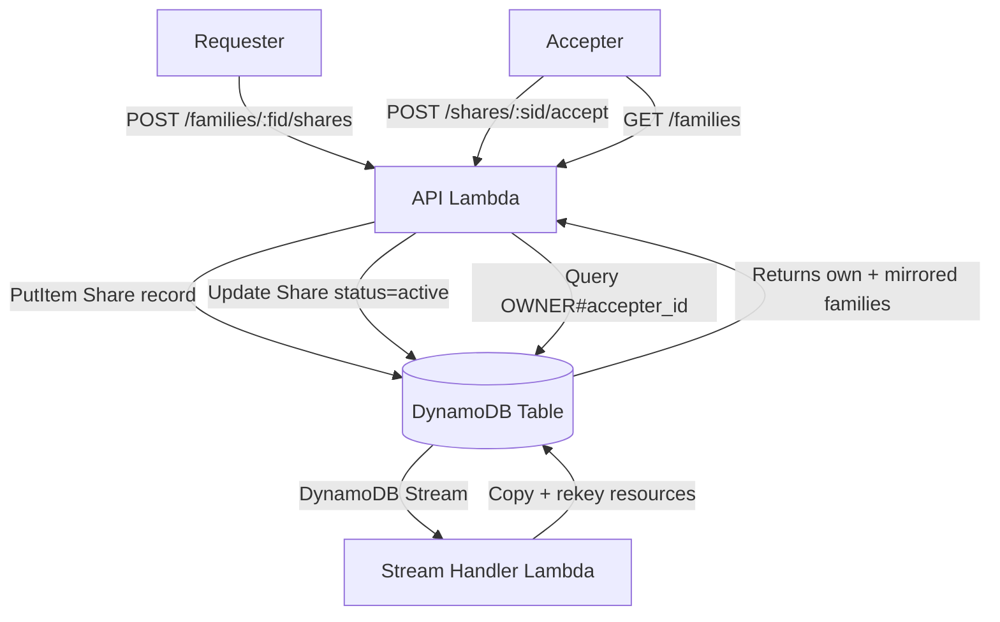
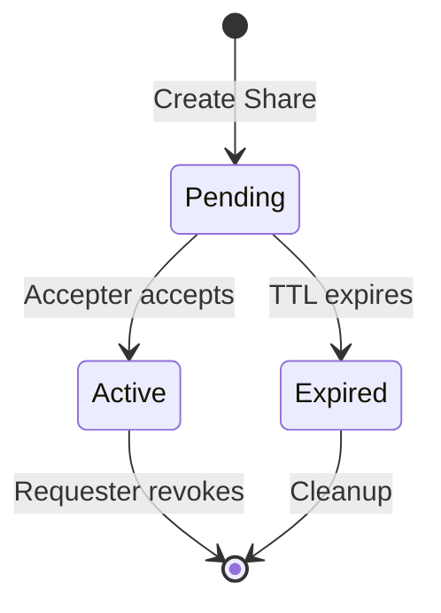

# Design Document: Resource Sharing

## Overview

Resource Sharing adds the ability for a Family owner (requester) to grant another user (accepter) access to their Family and its child resources (Dependents, Activities) at configurable permission scopes. The design extends the existing single-table DynamoDB schema with new Share record types and a DynamoDB Streams-based mirroring pipeline that copies shared resources into the accepter's owner partition. This means shared families appear alongside the accepter's own families using the same `OWNER#{identity_id}` partition key, preserving the existing tenant-isolated access patterns without cross-partition queries.

The share lifecycle is: **pending → active → (revoked/expired)**. A requester creates a share targeting an email address. When the accepter logs in and accepts, the share becomes active, triggering the stream handler to mirror resources. The requester can update permissions or revoke at any time. Unaccepted shares expire after a configurable TTL.

Key design decisions:
- Email is the canonical accepter identifier at creation time; the accepter's `IdentityId` is resolved on acceptance
- Mirrored records are full copies rekeyed into the accepter's partition, annotated with `share_id` and `permission_scope`
- Permission enforcement happens at the API layer by inspecting the `permission_scope` on mirrored records
- The stream handler is a separate Lambda triggered by DynamoDB Streams, not part of the API Lambda

## Architecture

### High-Level Flow



### Share Lifecycle



### DynamoDB Key Schema Extensions

The existing table (`FamtracData`) gains new record types. No changes to existing Family/Dependent/Activity key patterns.

| Record Type | PK | SK | Purpose |
|-------------|----|----|---------|
| Share (by owner) | `OWNER#{requester_id}` | `SHARE#{share_id}` | Owner's view of shares they created |
| Share (by email) | `SHARE_EMAIL#{accepter_email}` | `SHARE#{share_id}` | Lookup pending shares by accepter email |
| Mirrored Family | `OWNER#{accepter_id}` | `FAMILY#{family_id}` | Shared family in accepter's partition |
| Mirrored Dependent | `FAMILY#{family_id}` | `DEPENDENT#{dependent_id}` | Shared dependent (same key as original, but with share metadata) |
| Mirrored Activity | `FAMILY#{family_id}#DEPENDENT#{did}` | `ACTIVITY#{activity_id}` | Shared activity (same key as original, but with share metadata) |

**Design note on mirrored records:** Mirrored Family records are rekeyed into the accepter's `OWNER#{accepter_id}` partition so they appear in `list_families`. Mirrored Dependents and Activities use the same PK/SK as originals because they're accessed via the family_id path — the accepter reaches them through the mirrored Family. Each mirrored record carries `share_id` and `permission_scope` attributes to distinguish it from owned records and enable permission checks.

### GSI for Accepter Share Lookup

A new GSI enables listing all shares for an accepter by their identity ID (after acceptance):

| Attribute | Value |
|-----------|-------|
| GSI Name | `GSI-AccepterShares` |
| GSI PK | `accepter_id` |
| GSI SK | `SK` (table SK) |
| Projection | ALL |
| Condition | Only populated on Share records after acceptance |

## Components and Interfaces

### New Domain Types

```rust
// domain/share.rs

#[derive(Debug, Clone, PartialEq, Eq, Serialize, Deserialize)]
pub struct ShareId(pub Uuid);

#[derive(Debug, Clone, PartialEq, Eq, Serialize, Deserialize)]
#[serde(rename_all = "snake_case")]
pub enum ShareStatus {
    Pending,
    Active,
    Expired,
}

#[derive(Debug, Clone, PartialEq, Eq, Serialize, Deserialize)]
#[serde(rename_all = "snake_case")]
pub enum PermissionAction {
    FamilyRead,
    DependentRead,
    DependentWrite,
    ActivityRead,
    ActivityWrite,
}

#[derive(Debug, Clone, PartialEq, Eq, Serialize, Deserialize)]
pub struct PermissionScope {
    pub actions: Vec<PermissionAction>,
}

#[derive(Debug, Clone, PartialEq, Eq, Serialize, Deserialize)]
pub struct Share {
    pub id: ShareId,
    pub family_id: FamilyId,
    pub requester_id: IdentityId,
    pub accepter_email: String,
    pub accepter_id: Option<IdentityId>,
    pub permission_scope: PermissionScope,
    pub status: ShareStatus,
    pub created_at: Timestamp,
    pub updated_at: Timestamp,
    pub expires_at: Option<Timestamp>,
}
```

### PermissionScope Validation

```rust
impl PermissionScope {
    pub fn validate(&self) -> Result<(), ValidationError> {
        // 1. Must contain at least one action
        // 2. Must include FamilyRead
        // 3. DependentWrite requires DependentRead
        // 4. ActivityWrite requires ActivityRead + DependentRead
        // 5. No unrecognized actions (enforced by enum)
    }
}
```

### ShareRepository Trait

```rust
#[async_trait]
pub trait ShareRepository: Send + Sync {
    async fn create(&self, share: Share) -> Result<Share, StoreError>;
    async fn get(&self, requester_id: IdentityId, share_id: ShareId) -> Result<Option<Share>, StoreError>;
    async fn get_by_id(&self, share_id: ShareId) -> Result<Option<Share>, StoreError>;
    async fn update(&self, share: Share) -> Result<Share, StoreError>;
    async fn delete(&self, requester_id: IdentityId, share_id: ShareId) -> Result<(), StoreError>;
    async fn list_by_family(&self, requester_id: IdentityId, family_id: FamilyId) -> Result<Vec<Share>, StoreError>;
    async fn list_by_accepter_email(&self, email: &str) -> Result<Vec<Share>, StoreError>;
    async fn list_by_accepter_id(&self, accepter_id: IdentityId) -> Result<Vec<Share>, StoreError>;
    async fn get_by_family_and_email(&self, family_id: FamilyId, accepter_email: &str) -> Result<Option<Share>, StoreError>;
}
```

### DynamoDbShareRepository

Writes two items per Share (transact write):
1. `PK=OWNER#{requester_id}, SK=SHARE#{share_id}` — owner's partition
2. `PK=SHARE_EMAIL#{accepter_email}, SK=SHARE#{share_id}` — email lookup

On acceptance, updates both items and sets `accepter_id` for GSI indexing.

### Share Handlers

```rust
// handlers/share.rs

pub async fn create_share<SR: ShareRepository, FR: FamilyRepository>(
    request_body: &str,
    family_id: FamilyId,
    context: &RequestContext,
    share_repo: &SR,
    family_repo: &FR,
) -> Result<(u16, String), HandlerError>;

pub async fn list_shares<SR: ShareRepository, FR: FamilyRepository>(
    family_id: FamilyId,
    context: &RequestContext,
    share_repo: &SR,
    family_repo: &FR,
) -> Result<(u16, String), HandlerError>;

pub async fn update_share<SR: ShareRepository, FR: FamilyRepository>(
    request_body: &str,
    share_id: ShareId,
    context: &RequestContext,
    share_repo: &SR,
    family_repo: &FR,
) -> Result<(u16, String), HandlerError>;

pub async fn revoke_share<SR: ShareRepository, FR: FamilyRepository>(
    share_id: ShareId,
    context: &RequestContext,
    share_repo: &SR,
    family_repo: &FR,
) -> Result<(u16, String), HandlerError>;

pub async fn accept_share<SR: ShareRepository>(
    share_id: ShareId,
    context: &RequestContext,
    share_repo: &SR,
) -> Result<(u16, String), HandlerError>;

pub async fn list_shared_families<SR: ShareRepository>(
    context: &RequestContext,
    share_repo: &SR,
) -> Result<(u16, String), HandlerError>;
```

### Share Router

New routes added under the existing routing structure:

| Method | Path | Handler | Auth |
|--------|------|---------|------|
| POST | `/families/{fid}/shares` | `create_share` | Owner |
| GET | `/families/{fid}/shares` | `list_shares` | Owner |
| PUT | `/shares/{sid}` | `update_share` | Owner |
| DELETE | `/shares/{sid}` | `revoke_share` | Owner |
| POST | `/shares/{sid}/accept` | `accept_share` | Accepter |
| GET | `/shared-families` | `list_shared_families` | Accepter |

### Stream Handler (Separate Lambda)

The stream handler is a new Lambda function triggered by DynamoDB Streams on the `FamtracData` table. It processes:

1. **Share activation** (INSERT/MODIFY where `status` changes to `active`): Copies Family, all Dependents, and all Activities into the accepter's partition with `share_id` and `permission_scope` annotations.
2. **Resource changes** (INSERT/MODIFY/DELETE on Family/Dependent/Activity): Propagates to all mirrored copies by querying active shares for the affected family.
3. **Share revocation** (REMOVE of Share record): Deletes all mirrored records with the matching `share_id`.
4. **Permission update** (MODIFY of Share `permission_scope`): Updates `permission_scope` on all mirrored records with the matching `share_id`.

```rust
// stream_handler/src/main.rs

async fn handle_stream_event(event: DynamoDbEvent) -> Result<(), Error> {
    for record in event.records {
        match classify_record(&record) {
            RecordChange::ShareActivated(share) => mirror_resources(share).await?,
            RecordChange::ShareRevoked(share_id) => cleanup_mirrored(share_id).await?,
            RecordChange::SharePermissionUpdated(share) => update_mirrored_permissions(share).await?,
            RecordChange::ResourceChanged(change) => propagate_change(change).await?,
            RecordChange::Ignored => {},
        }
    }
    Ok(())
}
```

### Permission Enforcement

Existing handlers gain a permission check for mirrored resources:

```rust
// In handlers that access resources
fn check_permission(
    resource_share_id: Option<&ShareId>,
    resource_permission_scope: Option<&PermissionScope>,
    required_action: PermissionAction,
) -> Result<(), HandlerError> {
    // If share_id is None, this is an owned resource — full access
    // If share_id is Some, check permission_scope contains required_action
    // Return 403 Forbidden if not permitted
}
```

This check is added to existing Family, Dependent, and Activity handlers. The `share_id` and `permission_scope` fields are `Option` on the domain structs — `None` for owned resources, `Some` for mirrored resources.

## Data Models

### Share Record (DynamoDB — Owner Partition)

| Attribute | Type | Value |
|-----------|------|-------|
| PK | S | `OWNER#{requester_id}` |
| SK | S | `SHARE#{share_id}` |
| Type | S | `Share` |
| id | S | `{share_id}` |
| family_id | S | `{family_id}` |
| requester_id | S | `{requester_id}` |
| accepter_email | S | `{email}` |
| accepter_id | S | `{accepter_identity_id}` (set on acceptance) |
| permission_scope | S | JSON-serialized PermissionScope |
| status | S | `pending` / `active` / `expired` |
| created_at | S | ISO 8601 timestamp |
| updated_at | S | ISO 8601 timestamp |
| expires_in | N | Unix epoch seconds (DynamoDB TTL, set for pending shares) |

### Share Record (DynamoDB — Email Lookup)

| Attribute | Type | Value |
|-----------|------|-------|
| PK | S | `SHARE_EMAIL#{accepter_email}` |
| SK | S | `SHARE#{share_id}` |
| Type | S | `ShareEmailIndex` |
| *(same attributes as owner partition record)* | | |

### Mirrored Family Record

| Attribute | Type | Value |
|-----------|------|-------|
| PK | S | `OWNER#{accepter_id}` |
| SK | S | `FAMILY#{family_id}` |
| Type | S | `Family` |
| share_id | S | `{share_id}` |
| permission_scope | S | JSON-serialized PermissionScope |
| *(all original Family attributes)* | | |

### Mirrored Dependent Record

Same PK/SK as original Dependent, with additional:

| Attribute | Type | Value |
|-----------|------|-------|
| share_id | S | `{share_id}` |
| permission_scope | S | JSON-serialized PermissionScope |

### Mirrored Activity Record

Same PK/SK as original Activity, with additional:

| Attribute | Type | Value |
|-----------|------|-------|
| share_id | S | `{share_id}` |
| permission_scope | S | JSON-serialized PermissionScope |

### Domain Struct Extensions

The existing domain structs gain optional share metadata:

```rust
pub struct Family {
    // ... existing fields ...
    pub share_id: Option<ShareId>,
    pub permission_scope: Option<PermissionScope>,
}

pub struct Dependent {
    // ... existing fields ...
    pub share_id: Option<ShareId>,
    pub permission_scope: Option<PermissionScope>,
}

pub struct Activity {
    // ... existing fields ...
    pub share_id: Option<ShareId>,
    pub permission_scope: Option<PermissionScope>,
}
```

These fields are `None` for owned resources and `Some` for mirrored resources. Serialization uses `#[serde(skip_serializing_if = "Option::is_none")]` to keep existing API responses unchanged for owned resources.

## Correctness Properties

*A property is a characteristic or behavior that should hold true across all valid executions of a system — essentially, a formal statement about what the system should do. Properties serve as the bridge between human-readable specifications and machine-verifiable correctness guarantees.*

### Property 1: Share creation produces complete pending record

*For any* valid accepter email and valid permission scope, creating a share on an owned family SHALL produce a Share record with status `pending`, the requester's identity, the accepter email, the family identifier, the permission scope, and a creation timestamp — all matching the input.

**Validates: Requirements 1.1, 1.5**

### Property 2: Ownership enforcement on share operations

*For any* family owned by identity A and any share operation (create, list, update, revoke) attempted by identity B where B ≠ A, the API SHALL return a 404 Not Found error and no share data shall be returned or modified.

**Validates: Requirements 1.2, 5.2, 6.4, 7.4**

### Property 3: Permission scope validation rules

*For any* set of permission actions, the permission scope is valid if and only if: (a) it contains at least one action, (b) it includes `family:read`, (c) if it contains `dependent:write` then it also contains `dependent:read`, and (d) if it contains `activity:write` then it also contains both `activity:read` and `dependent:read`. All other combinations SHALL be rejected with a validation error.

**Validates: Requirements 2.2, 2.3, 2.4, 2.5**

### Property 4: Share activation mirrors all resources with metadata

*For any* share that transitions to `active` status on a family with N dependents and M activities, the stream handler SHALL create mirrored copies of the family (rekeyed to `OWNER#{accepter_id}`), all N dependents, and all M activities, each annotated with the share's `share_id` and `permission_scope`.

**Validates: Requirements 3.1, 3.2, 3.3, 3.4, 3.5**

### Property 5: Resource change propagation to mirrored copies

*For any* resource (Family, Dependent, Activity) that is created, updated, or deleted on a family with K active shares, the stream handler SHALL propagate the change to all K mirrored copies in the respective accepter partitions.

**Validates: Requirements 3.6**

### Property 6: Permission enforcement on mirrored resources

*For any* mirrored resource with a given permission scope and any operation requiring a specific permission action, the operation SHALL succeed if and only if the permission scope includes that required action. Operations not covered by the scope SHALL return a 403 Forbidden error.

**Validates: Requirements 4.1, 4.2, 4.3**

### Property 7: Owner retains full access regardless of shares

*For any* family with any number of active shares, the owner (requester) SHALL retain full read and write access to all resources on the family, unaffected by the existence or permission scopes of any shares.

**Validates: Requirements 4.5**

### Property 8: List shares returns complete set with status

*For any* family owned by the requester with N share records, listing shares SHALL return exactly N records, each including the accepter identity (or email if pending), permission scope, and share status (pending, active, or expired).

**Validates: Requirements 5.1, 10.3**

### Property 9: Share update replaces permission scope

*For any* existing share and any new valid permission scope, updating the share SHALL replace the existing permission scope with the new one, and the updated share SHALL pass the same validation rules as share creation.

**Validates: Requirements 6.1, 6.5**

### Property 10: Share revocation deletes share record

*For any* existing share on a family owned by the requester, revoking the share SHALL remove the share record from the data store such that subsequent lookups return None.

**Validates: Requirements 7.1**

### Property 11: Revocation cleans up mirrored records

*For any* revoked share with share_id S, the stream handler SHALL delete all mirrored records (Family, Dependent, Activity) that carry share_id S from the accepter's partition, leaving zero mirrored records for that share.

**Validates: Requirements 7.2**

### Property 12: Accepter share listing returns all shares

*For any* accepter identity with N active shares across different families, listing shared families SHALL return exactly N share records, each including the family identifier and permission scope.

**Validates: Requirements 8.1**

### Property 13: Share acceptance transitions to active with identity

*For any* pending share where the accepter email matches the authenticated user's email, accepting the share SHALL set the status to `active` and store the authenticated user's canonical identity identifier on the share record.

**Validates: Requirements 9.1**

### Property 14: Email mismatch on acceptance returns 403

*For any* pending share and any authenticated user whose email does not match the share's accepter email, attempting to accept SHALL return a 403 Forbidden error and the share status SHALL remain unchanged.

**Validates: Requirements 9.2**

### Property 15: Non-pending share acceptance returns validation error

*For any* share in `active` or `expired` status, attempting to accept SHALL return a validation error and the share status SHALL remain unchanged.

**Validates: Requirements 9.3**

### Property 16: Expired shares excluded from active checks

*For any* share whose creation timestamp plus the configurable expiration period is in the past, the API SHALL treat the share as expired and exclude it from active permission checks, regardless of whether the DynamoDB TTL has physically deleted the record.

**Validates: Requirements 10.1**

### Property 17: Share serialization round-trip

*For any* valid Share object, serializing to JSON and then deserializing back SHALL produce an object equal to the original.

**Validates: Requirements 11.4**

### Property 18: Invalid JSON returns 400

*For any* string that is not valid JSON or does not conform to the expected share request schema, the API SHALL return a 400 Bad Request error with details about the parsing failure.

**Validates: Requirements 11.2**

### Property 19: Write-back propagation from mirrored to original

*For any* write operation performed by an accepter on a mirrored resource (where the permission scope allows the write), the stream handler SHALL propagate the write back to the original family partition so the owner sees the change.

**Validates: Requirements 4.4**

## Error Handling

### API Layer Errors

| Scenario | HTTP Status | Error Code | Details |
|----------|-------------|------------|---------|
| Share request with invalid JSON | 400 | `VALIDATION_ERROR` | Parsing failure details |
| Empty or invalid permission scope | 400 | `VALIDATION_ERROR` | Field: `permission_scope`, constraint details |
| Self-sharing (requester email = accepter email) | 400 | `VALIDATION_ERROR` | Field: `accepter_email`, "cannot share with yourself" |
| Duplicate share (same family + email) | 409 | `CONFLICT_ERROR` | "Share already exists for this family and email" |
| Share operation on non-owned family | 404 | `NOT_FOUND` | "Family not found" (no information leakage) |
| Share not found (update/revoke/accept) | 404 | `NOT_FOUND` | "Share not found" |
| Accept share with email mismatch | 403 | `FORBIDDEN` | "Email does not match" |
| Accept non-pending share | 400 | `VALIDATION_ERROR` | "Share is not in pending status" |
| Accept expired share | 400 | `VALIDATION_ERROR` | "Share has expired" |
| Operation on mirrored resource without permission | 403 | `FORBIDDEN` | "Insufficient permissions for this operation" |
| DynamoDB connection/query failure | 500 | `INTERNAL_ERROR` | "An internal error occurred" |

### Error Type Extensions

The existing `HandlerError` enum needs a new variant for conflict errors and forbidden errors:

```rust
pub enum HandlerError {
    // ... existing variants ...
    Conflict(String),    // 409 Conflict
    Forbidden(String),   // 403 Forbidden
}

pub enum StoreError {
    // ... existing variants ...
    ConflictError(String),  // Already exists
}
```

`StoreError::ConflictError` already exists in the codebase. `HandlerError` needs `Conflict` and `Forbidden` variants added, with corresponding `status_code()` and `to_error_response()` implementations.

### Stream Handler Error Handling

The stream handler operates asynchronously and cannot return errors to the API caller. Error handling strategy:

- **Retries**: DynamoDB Streams automatically retries failed Lambda invocations. The stream handler must be idempotent.
- **Dead Letter Queue**: Failed events after max retries go to an SQS DLQ for manual investigation.
- **Partial failures**: Use `ReportBatchItemFailures` to retry only failed records, not the entire batch.
- **Idempotency**: Mirroring operations use conditional writes (`attribute_not_exists` or version checks) to safely handle duplicate processing.

## Testing Strategy

### Property-Based Testing

Use the `proptest` crate for property-based testing. Each property test runs a minimum of 100 iterations.

Each property-based test must be tagged with a comment referencing the design property:
```rust
// Feature: resource-sharing, Property 1: Share creation produces complete pending record
```

| Property | Test Approach |
|----------|--------------|
| P1: Share creation | Generate random valid emails and permission scopes, call `create_share`, verify all fields on returned share |
| P2: Ownership enforcement | Generate random identity pairs (owner ≠ requester), attempt share operations, assert 404 |
| P3: Permission scope validation | Generate random subsets of `PermissionAction`, call `PermissionScope::validate()`, verify result matches the rules |
| P4: Share activation mirroring | Generate random families with dependents/activities, activate a share, verify all mirrored records exist with correct metadata |
| P5: Resource change propagation | Generate random resource changes on shared families, verify all mirrored copies are updated |
| P6: Permission enforcement | Generate random permission scopes and operations, call `check_permission`, verify result matches scope contents |
| P7: Owner full access | Generate random families with shares, perform operations as owner, verify all succeed |
| P8: List shares completeness | Generate random sets of shares for a family, list them, verify count and data completeness |
| P9: Share update | Generate random shares and new valid scopes, update, verify scope is replaced |
| P10: Share revocation | Generate random shares, revoke, verify share is deleted |
| P11: Revocation cleanup | Generate random shares with mirrored records, revoke, verify all mirrored records deleted |
| P12: Accepter listing | Generate random shares across families for an accepter, list, verify count and data |
| P13: Share acceptance | Generate random pending shares with matching emails, accept, verify status=active and identity stored |
| P14: Email mismatch | Generate random shares with non-matching emails, attempt accept, verify 403 |
| P15: Non-pending acceptance | Generate random shares in active/expired status, attempt accept, verify validation error |
| P16: Expired shares | Generate random shares with past expiration, verify they're excluded from active checks |
| P17: Serialization round-trip | Generate random valid Share objects, serialize to JSON, deserialize, assert equality |
| P18: Invalid JSON | Generate random non-JSON strings, attempt parse, verify 400 error |
| P19: Write-back propagation | Generate random writes on mirrored resources, verify propagation to original partition |

### Unit Testing

Unit tests complement property tests for specific examples and edge cases:

- Self-sharing rejection (requester email = own email)
- Duplicate share conflict detection
- Empty permission scope rejection
- Accept share that doesn't exist (404)
- Revoke share that doesn't exist (404)
- Update share that doesn't exist (404)
- Empty share list for family with no shares
- Empty shared families list for accepter with no shares
- Permission scope with unrecognized action in raw JSON (deserialization failure)
- Accept expired share (validation error)
- Mirrored resource with `share_id=None` treated as owned (full access)

### Integration Testing

End-to-end tests against DynamoDB Local:

- Full share lifecycle: create → accept → use → revoke
- Stream handler mirroring: activate share, verify mirrored records appear
- Stream handler cleanup: revoke share, verify mirrored records removed
- Permission enforcement: accepter with read-only scope cannot write
- Owner access unaffected by shares
- TTL expiration of pending shares
- Concurrent share operations (two shares on same family to different accepters)
