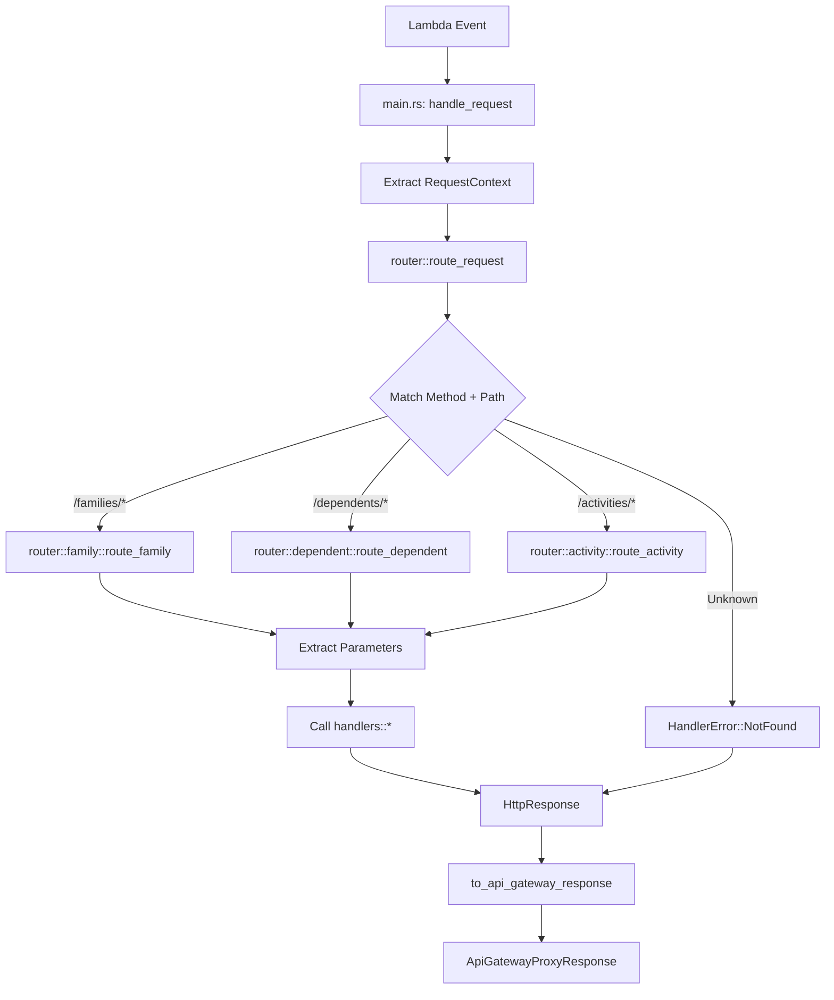
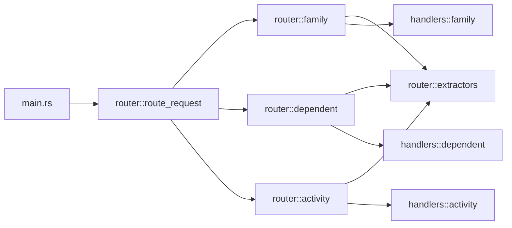

# Design Document: Router Module Refactoring

## Overview

This design describes the refactoring of routing logic from `src/main.rs` into a dedicated `src/router/` module. The refactoring extracts approximately 200 lines of route matching and parameter extraction logic into a well-organized module structure that mirrors the existing `src/handlers/` organization.

The refactoring is purely structural - no behavior changes, no new features. The goal is to improve code organization by separating concerns: `main.rs` handles Lambda infrastructure, while the new `router` module handles HTTP routing.

Key benefits:
- Cleaner separation between Lambda setup and routing logic
- Improved testability of routing logic independent of Lambda infrastructure
- Better code organization mirroring the handlers module structure
- Easier maintenance and future routing changes

## Architecture

### Module Structure

The new router module will follow this structure:

```
src/router/
├── mod.rs           # Main routing function and module exports
├── family.rs        # Family route handlers
├── dependent.rs     # Dependent route handlers
├── activity.rs      # Activity route handlers
└── extractors.rs    # Path parameter extraction utilities
```

This mirrors the existing `src/handlers/` structure, creating a clear parallel between routing and handler logic.

### Routing Flow



### Dependency Flow



The router module sits between `main.rs` and `handlers`, with no circular dependencies.

## Components and Interfaces

### router::route_request

The main routing function that dispatches requests to appropriate route handlers.

```rust
pub fn route_request(
    request: &ApiGatewayProxyRequest,
    context: &RequestContext,
    family_repo: &DynamoDbFamilyRepository,
    dependent_repo: &DynamoDbDependentRepository,
    activity_repo: &DynamoDbActivityRepository,
    cors_config: &CorsConfig,
) -> HttpResponse
```

Responsibilities:
- Extract HTTP method and path from request
- Log routing information
- Match method/path combinations to route handlers
- Delegate to appropriate submodule route function
- Return HandlerError::NotFound for unknown routes
- Convert handler results to HttpResponse with CORS headers

### router::family::route_family

Handles all `/families/*` routes.

```rust
pub fn route_family(
    method: &str,
    path: &str,
    body: &str,
    context: &RequestContext,
    family_repo: &DynamoDbFamilyRepository,
    dependent_repo: &DynamoDbDependentRepository,
) -> Result<serde_json::Value, HandlerError>
```

Routes handled:
- `POST /families` → `handlers::create_family`
- `GET /families/{id}` → `handlers::get_family`
- `PUT /families/{id}` → `handlers::update_family`
- `GET /families/{id}/dependents` → `handlers::list_dependents`

### router::dependent::route_dependent

Handles all `/dependents/*` routes.

```rust
pub fn route_dependent(
    method: &str,
    path: &str,
    body: &str,
    context: &RequestContext,
    family_repo: &DynamoDbFamilyRepository,
    dependent_repo: &DynamoDbDependentRepository,
) -> Result<serde_json::Value, HandlerError>
```

Routes handled:
- `POST /dependents` → `handlers::create_dependent`
- `GET /dependents/{id}` → `handlers::get_dependent`
- `PUT /dependents/{id}` → `handlers::update_dependent`

### router::activity::route_activity

Handles all `/activities/*` routes.

```rust
pub fn route_activity(
    method: &str,
    path: &str,
    body: &str,
    request: &ApiGatewayProxyRequest,
    context: &RequestContext,
    family_repo: &DynamoDbFamilyRepository,
    dependent_repo: &DynamoDbDependentRepository,
    activity_repo: &DynamoDbActivityRepository,
) -> Result<serde_json::Value, HandlerError>
```

Routes handled:
- `POST /activities` → `handlers::create_activity`
- `GET /activities/{id}` → `handlers::get_activity`
- `PUT /activities/{id}` → `handlers::update_activity`
- `DELETE /activities/{id}` → `handlers::delete_activity`
- `GET /dependents/{id}/activities` → `handlers::query_activities` (with query params)

Note: This function needs the full `ApiGatewayProxyRequest` to access query parameters for the activities query endpoint.

### router::extractors

Utility functions for extracting and validating path parameters.

```rust
pub fn extract_path_param(path: &str, prefix: &str) -> Option<String>
```

Extracts a path segment after a given prefix. For example, given path `/families/123-456` and prefix `/families/`, returns `Some("123-456")`.

```rust
pub fn extract_uuid_param(
    path: &str,
    prefix: &str,
    field_name: &str,
) -> Result<uuid::Uuid, HandlerError>
```

Extracts and parses a UUID from a path. Returns `HandlerError::Validation` if the UUID is invalid, with the field name specified for error reporting.

## Data Models

No new data models are introduced. The refactoring uses existing types:

- `ApiGatewayProxyRequest` - AWS Lambda API Gateway request
- `RequestContext` - Authentication and request context
- `HttpResponse` - HTTP response wrapper with CORS headers
- `HandlerError` - Error types for handler failures
- `ValidationError` - Validation error details
- Repository types: `DynamoDbFamilyRepository`, `DynamoDbDependentRepository`, `DynamoDbActivityRepository`
- Domain types: `FamilyId`, `DependentId`, `ActivityId`, `Date`, `ActivityType`


## Correctness Properties

*A property is a characteristic or behavior that should hold true across all valid executions of a system-essentially, a formal statement about what the system should do. Properties serve as the bridge between human-readable specifications and machine-verifiable correctness guarantees.*

Since this is a pure refactoring with no behavior changes, the correctness properties focus on behavior preservation. The refactored router module must produce identical results to the current implementation for all inputs.

### Property 1: Routing Behavior Preservation

*For any* valid HTTP method and path combination that is currently handled by the route_request() function in main.rs, the refactored router::route_request() function SHALL produce an identical HttpResponse with the same status code, body content, and headers.

**Validates: Requirements 2.4, 3.3, 3.4, 3.5, 4.3, 4.4, 4.5, 5.3, 5.4, 5.5, 7.1, 7.3**

This is the primary correctness property for the refactoring. It ensures that all routing behavior is preserved exactly. This property subsumes individual route testing because if all routes produce identical results, then each individual route must work correctly.

### Property 2: Error Handling Preservation

*For any* HTTP method and path combination that produces an error in the current route_request() function, the refactored router::route_request() function SHALL return a HandlerError with the same error type, error code, and error message.

**Validates: Requirements 2.5, 3.6, 4.6, 5.6, 6.3, 7.2**

This ensures that error cases are handled identically. Invalid UUIDs, unknown routes, and other error conditions must produce the same errors as before.

### Property 3: CORS Header Preservation

*For any* handler result (success or error), the refactored router SHALL apply CORS headers through HttpResponse::from_handler_result() in the same manner as the current implementation, resulting in identical Access-Control-* headers in the response.

**Validates: Requirements 7.5**

CORS handling is critical for the API to function correctly with web clients. This property ensures CORS behavior is unchanged.

### Property 4: Path Parameter Extraction Equivalence

*For any* path string and prefix combination, the router::extractors::extract_path_param() function SHALL return the same result as the current extract_path_param() function in main.rs.

**Validates: Requirements 6.4**

This ensures the extracted utility function behaves identically to the original.

### Example Test Cases

While properties cover general behavior, specific examples help verify concrete scenarios:

**Example 1: POST /families route**
- Method: POST, Path: "/families", Body: valid JSON
- Expected: Calls handlers::create_family() with body, context, and family_repo
- **Validates: Requirements 3.2**

**Example 2: POST /dependents route**
- Method: POST, Path: "/dependents", Body: valid JSON
- Expected: Calls handlers::create_dependent() with body, context, family_repo, and dependent_repo
- **Validates: Requirements 4.2**

**Example 3: POST /activities route**
- Method: POST, Path: "/activities", Body: valid JSON
- Expected: Calls handlers::create_activity() with body, context, and all three repositories
- **Validates: Requirements 5.2**

**Example 4: Logging preservation**
- Any method and path
- Expected: Log message "Routing: {method} {path}" is produced
- **Validates: Requirements 7.4**

## Error Handling

The router module preserves all existing error handling behavior:

### Invalid UUID Handling

When a path contains an invalid UUID (e.g., `/families/not-a-uuid`), the router SHALL:
1. Attempt to parse the UUID using `uuid::Uuid::parse_str()`
2. On parse failure, return `HandlerError::Validation` with:
   - `field`: The parameter name (e.g., "family_id", "dependent_id", "activity_id")
   - `message`: "Invalid {field} format"
   - `constraint`: Some("must be a valid UUID")

This is implemented in `router::extractors::extract_uuid_param()` and used consistently across all route handlers.

### Unknown Route Handling

When a method/path combination doesn't match any known route, the router SHALL:
1. Return `HandlerError::NotFound` with message: "Route not found: {method} {path}"
2. This error is converted to a 404 HTTP response with appropriate error JSON

### Error Response Format

All errors are converted to HTTP responses through `HttpResponse::from_handler_result()`, which:
1. Maps error types to HTTP status codes via `HandlerError::status_code()`
2. Converts errors to JSON via `HandlerError::to_error_response()`
3. Applies CORS headers via `CorsConfig`

This ensures consistent error responses across all routes.

## Testing Strategy

### Dual Testing Approach

The router module will be tested using both unit tests and property-based tests:

**Unit Tests** focus on:
- Specific route examples (POST /families, POST /dependents, POST /activities)
- Edge cases (empty paths, malformed UUIDs, boundary conditions)
- Error conditions (unknown routes, invalid parameters)
- Logging behavior verification

**Property-Based Tests** focus on:
- Routing behavior preservation across all valid inputs
- Error handling preservation across all error inputs
- CORS header consistency across all responses
- Path parameter extraction equivalence

### Property-Based Testing Configuration

We will use the `proptest` crate for property-based testing in Rust. Configuration:

- **Library**: proptest (standard Rust PBT library)
- **Iterations**: Minimum 100 cases per property test
- **Test Organization**: Property tests in `tests/property_router_*.rs` files
- **Tagging**: Each test includes a doc comment referencing the design property

Example test structure:

```rust
/// Feature: router-module-refactoring, Property 1: Routing Behavior Preservation
/// 
/// For any valid HTTP method and path combination that is currently handled,
/// the refactored router must produce identical results.
#[test]
fn prop_routing_behavior_preserved() {
    proptest!(|(
        method in prop_http_method(),
        path in prop_valid_route_path(),
        uuid in prop_uuid(),
    )| {
        // Test that old and new implementations produce same result
    });
}
```

### Test Strategy Details

**Unit Tests** (`tests/router_unit_test.rs`):
- Test each route handler function independently
- Mock repositories to isolate routing logic
- Verify correct handler is called with correct parameters
- Test error cases with invalid inputs
- Verify logging output

**Property Tests** (`tests/property_router_preservation.rs`):
- Generate random valid routes and verify identical behavior
- Generate random invalid routes and verify identical errors
- Generate random UUIDs and verify extraction works correctly
- Compare old main.rs implementation with new router implementation

**Integration Tests** (existing tests):
- Existing integration tests should continue to pass without modification
- These tests verify end-to-end behavior through the Lambda handler
- No changes needed to integration tests (validates requirement 9.5)

### Testing the Refactoring Process

To ensure the refactoring is correct, we will:

1. **Before refactoring**: Run all existing tests to establish baseline
2. **During refactoring**: Keep both implementations temporarily to enable comparison testing
3. **After refactoring**: Verify all tests still pass
4. **Property tests**: Explicitly compare old vs new implementation for identical behavior

This approach ensures we can prove the refactoring preserves behavior.

## Implementation Plan

### Phase 1: Create Router Module Structure

1. Create `src/router/` directory
2. Create `src/router/mod.rs` with module declarations
3. Create empty submodules: `family.rs`, `dependent.rs`, `activity.rs`, `extractors.rs`
4. Add `pub mod router;` to `src/lib.rs`

### Phase 2: Implement Extractors

1. Copy `extract_path_param()` from main.rs to `router/extractors.rs`
2. Implement `extract_uuid_param()` using `extract_path_param()` and UUID parsing
3. Add unit tests for extractors
4. Export extractors from `router/mod.rs`

### Phase 3: Implement Route Handlers

1. Implement `router/family.rs::route_family()`
   - Handle POST /families
   - Handle GET /families/{id}
   - Handle PUT /families/{id}
   - Handle GET /families/{id}/dependents
   - Use extractors for UUID parsing

2. Implement `router/dependent.rs::route_dependent()`
   - Handle POST /dependents
   - Handle GET /dependents/{id}
   - Handle PUT /dependents/{id}
   - Use extractors for UUID parsing

3. Implement `router/activity.rs::route_activity()`
   - Handle POST /activities
   - Handle GET /activities/{id}
   - Handle PUT /activities/{id}
   - Handle DELETE /activities/{id}
   - Handle GET /dependents/{id}/activities (with query params)
   - Use extractors for UUID parsing

4. Export route functions from `router/mod.rs`

### Phase 4: Implement Main Router Function

1. Implement `router/mod.rs::route_request()`
   - Extract method, path, and body from request
   - Add logging: "Routing: {method} {path}"
   - Match on path prefix to delegate to appropriate submodule
   - Handle unknown routes with NotFound error
   - Convert results to HttpResponse with CORS headers

2. Export `route_request` from `router/mod.rs`

### Phase 5: Update Main Module

1. Import `router::route_request` in `src/main.rs`
2. Replace inline `route_request()` call with `router::route_request()`
3. Remove old `route_request()` function from main.rs
4. Remove old `extract_path_param()` function from main.rs
5. Verify main.rs only contains Lambda setup code

### Phase 6: Testing

1. Run existing integration tests - should pass unchanged
2. Add unit tests for router module
3. Add property-based tests comparing old vs new behavior
4. Verify all tests pass
5. Verify code coverage for router module

### Phase 7: Cleanup and Documentation

1. Add module-level documentation to router/mod.rs
2. Add function documentation to all public functions
3. Update any relevant README files
4. Remove any temporary comparison code
5. Final verification of all tests

## Migration Considerations

### Backward Compatibility

This refactoring maintains 100% backward compatibility:
- Lambda handler signature unchanged
- API routes unchanged
- Request/response formats unchanged
- Error responses unchanged
- CORS behavior unchanged

No changes required for:
- API clients
- Infrastructure code
- Environment variables
- DynamoDB schema
- Authentication/authorization

### Rollback Plan

If issues are discovered after deployment:
1. Revert the commit that introduced the router module
2. Redeploy the previous version
3. No data migration or API changes needed

The refactoring is purely internal code organization, so rollback is straightforward.

### Performance Considerations

The refactoring should have negligible performance impact:
- Same number of function calls (just organized differently)
- No additional allocations
- No additional I/O
- Same routing logic, just in different files

The only difference is an additional function call layer (route_request → route_family/dependent/activity), which is insignificant compared to network and database latency.

## Risks and Mitigations

### Risk 1: Behavior Divergence

**Risk**: Refactored code behaves differently than original code

**Mitigation**:
- Property-based tests explicitly compare old vs new implementations
- Comprehensive unit test coverage
- All existing integration tests must pass
- Manual testing of all routes before deployment

### Risk 2: Missing Edge Cases

**Risk**: Edge cases handled in original code are missed in refactoring

**Mitigation**:
- Careful line-by-line review of original route_request() function
- Property-based tests with random inputs catch unexpected cases
- Test with malformed inputs, boundary conditions, special characters

### Risk 3: Error Message Changes

**Risk**: Error messages inadvertently change, breaking client expectations

**Mitigation**:
- Property 2 explicitly tests error message preservation
- Unit tests verify exact error messages
- Review all error handling code for consistency

### Risk 4: CORS Issues

**Risk**: CORS headers not applied correctly, breaking web clients

**Mitigation**:
- Property 3 explicitly tests CORS header preservation
- Integration tests verify CORS headers in responses
- Manual testing with browser-based client

## Success Criteria

The refactoring is successful when:

1. ✅ All existing integration tests pass without modification
2. ✅ All new unit tests pass
3. ✅ All property-based tests pass (100+ iterations each)
4. ✅ Code coverage for router module ≥ 90%
5. ✅ main.rs reduced by ~200 lines
6. ✅ No behavior changes detected in manual testing
7. ✅ All routes return identical responses to original implementation
8. ✅ All error cases return identical errors to original implementation
9. ✅ CORS headers present and correct in all responses
10. ✅ Logging output unchanged

## Conclusion

This refactoring improves code organization by extracting routing logic from main.rs into a dedicated router module. The design ensures behavior preservation through comprehensive property-based testing that explicitly compares old and new implementations.

The modular structure (family.rs, dependent.rs, activity.rs) mirrors the handlers module, making the codebase more maintainable and easier to understand. The extractors module provides reusable utilities for path parameter handling.

By focusing on behavior preservation and using property-based testing to verify equivalence, we can confidently refactor the code while maintaining 100% backward compatibility.
