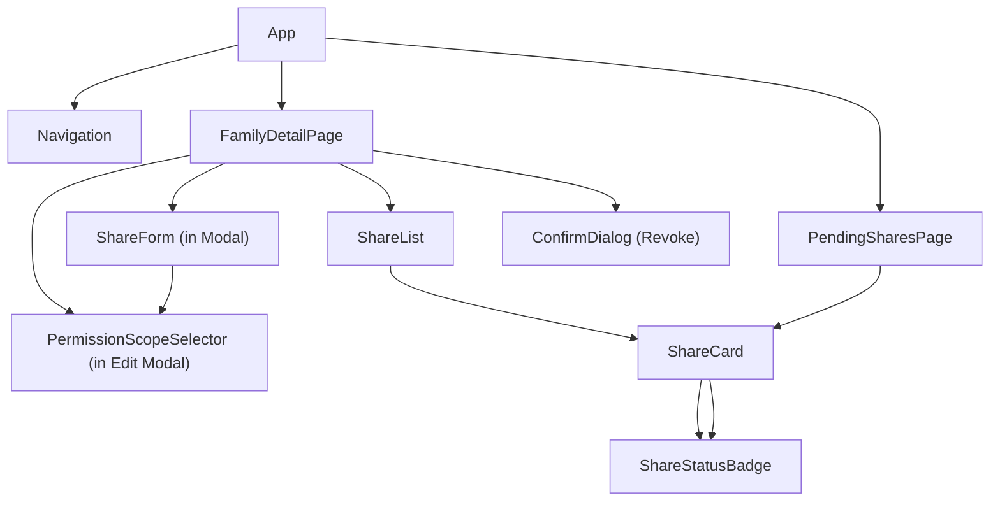
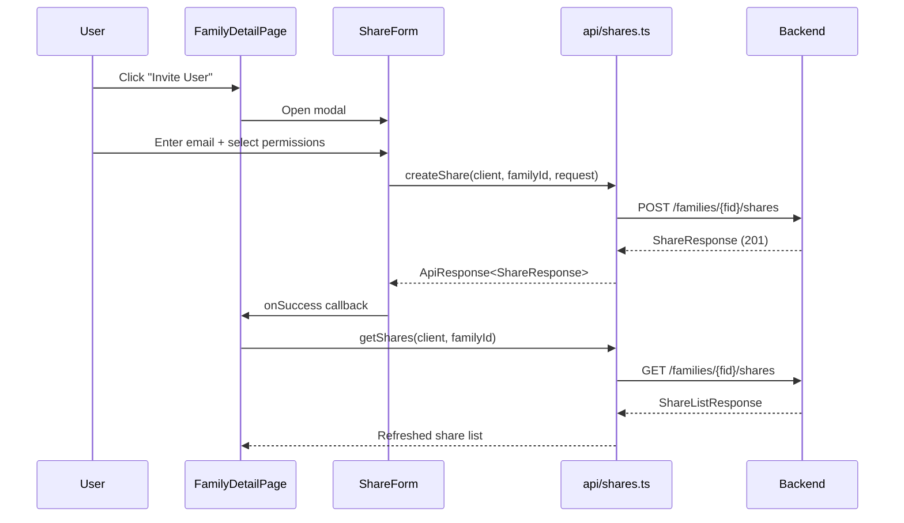
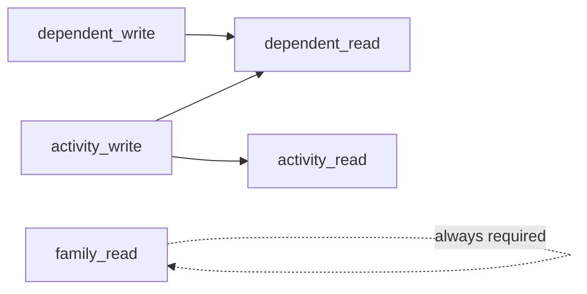

# Design Document: Share Management UI

## Overview

Share Management UI adds share CRUD operations to the famtrac-frontend React application. Family owners can create shares (invite by email with permission scopes), list/edit/revoke shares from the Family Detail Page, and accepters can view and accept pending invitations on a dedicated Shared With Me page. The feature follows the existing frontend architecture: a new `api/shares.ts` module with typed functions, domain types in `types/domain.ts`, new components under `components/shares/`, a new `PendingSharesPage`, and integration into the existing `FamilyDetailPage` and `Navigation`.

Key design decisions:
- Permission dependency enforcement is handled client-side in the `PermissionScopeSelector` component, mirroring the backend validation rules. This gives immediate feedback without a round-trip.
- The `PermissionScopeSelector` is a controlled component that emits a `PermissionScope` object, reusable in both create and edit flows.
- Share list endpoints support cursor-based pagination (`limit`/`next_token` query params) matching the existing `FamilyListResponse` and `DependentListResponse` patterns. The frontend uses a "Load More" button to fetch additional pages.
- Share list on `FamilyDetailPage` uses the same `useApi`/`useApiMutation` pattern as the existing dependents section.
- The `PendingSharesPage` is a new top-level page at `/shares`, protected by `ProtectedRoute`, linked from `Navigation`.
- All API types mirror the backend JSON schema exactly (snake_case fields) to avoid mapping layers.

## Architecture

### Component Hierarchy



### Data Flow



### File Structure

```
famtrac-frontend/src/
├── api/
│   └── shares.ts                    # Share API client functions
├── types/
│   └── domain.ts                    # + Share, PermissionScope, PermissionAction, ShareStatus
├── components/
│   └── shares/
│       ├── ShareCard.tsx            # Single share display with actions
│       ├── ShareList.tsx            # List of ShareCards with loading/empty/error states
│       ├── ShareForm.tsx            # Create share form (email + permissions)
│       ├── ShareStatusBadge.tsx     # Colored status badge
│       └── PermissionScopeSelector.tsx  # Checkbox group with dependency enforcement
├── pages/
│   └── PendingSharesPage.tsx        # /shares route - accepter's view
├── utils/
│   └── validation.ts               # + email() validator
│   └── permissions.ts              # Permission dependency logic (pure functions)
```

## Components and Interfaces

### API Client Module (`api/shares.ts`)

Follows the same pattern as `api/families.ts` and `api/dependents.ts`: exported async functions taking `(client: ApiClient, ...params)` and returning `Promise<ApiResponse<T>>`.

```typescript
// api/shares.ts
import { ApiClient, ApiResponse } from './client';
import { CreateShareRequest, UpdateShareRequest, ShareResponse, ShareListResponse } from './types';

export async function createShare(
  client: ApiClient, familyId: string, request: CreateShareRequest
): Promise<ApiResponse<ShareResponse>>;

export async function getShares(
  client: ApiClient, familyId: string,
  options?: { limit?: number; next_token?: string }
): Promise<ApiResponse<ShareListResponse>>;

export async function updateShare(
  client: ApiClient, shareId: string, request: UpdateShareRequest
): Promise<ApiResponse<ShareResponse>>;

export async function revokeShare(
  client: ApiClient, shareId: string
): Promise<ApiResponse<void>>;

export async function acceptShare(
  client: ApiClient, shareId: string
): Promise<ApiResponse<ShareResponse>>;

export async function getSharesForAccepter(
  client: ApiClient,
  options?: { limit?: number; next_token?: string }
): Promise<ApiResponse<ShareListResponse>>;
```

The `getShares` and `getSharesForAccepter` functions build query parameters from the optional `options` object, following the same pattern as `getActivities` in `api/activities.ts`:

```typescript
// Example implementation for getShares
export async function getShares(
  client: ApiClient, familyId: string,
  options?: { limit?: number; next_token?: string }
): Promise<ApiResponse<ShareListResponse>> {
  let path = `/families/${familyId}/shares`;
  const params = new URLSearchParams();
  if (options?.limit) params.append('limit', String(options.limit));
  if (options?.next_token) params.append('next_token', options.next_token);
  const qs = params.toString();
  if (qs) path += `?${qs}`;
  return client.get<ShareListResponse>(path);
}
```

### API Types (`api/types.ts` additions)

```typescript
// Added to api/types.ts

export interface CreateShareRequest {
  accepter_email: string;
  permission_scope: { actions: string[] };
}

export interface UpdateShareRequest {
  permission_scope: { actions: string[] };
}

export interface ShareResponse {
  id: string;
  family_id: string;
  requester_id: string;
  accepter_email: string;
  accepter_id?: string;
  permission_scope: { actions: string[] };
  status: string;
  created_at: string;
  updated_at: string;
  expires_at?: string;
}

export interface ShareListResponse {
  shares: ShareResponse[];
  next_token?: string;
}
```

### Domain Types (`types/domain.ts` additions)

```typescript
// Added to types/domain.ts

export type PermissionAction =
  | 'family_read'
  | 'dependent_read'
  | 'dependent_write'
  | 'activity_read'
  | 'activity_write';

export interface PermissionScope {
  actions: PermissionAction[];
}

export type ShareStatus = 'pending' | 'active' | 'expired';

export interface Share {
  id: string;
  family_id: string;
  requester_id: string;
  accepter_email: string;
  accepter_id?: string;
  permission_scope: PermissionScope;
  status: ShareStatus;
  created_at: string;
  updated_at: string;
  expires_at?: string;
}
```

### Permission Utilities (`utils/permissions.ts`)

Pure functions for permission dependency logic, used by both `PermissionScopeSelector` and form validation. Keeping this logic in a utility module makes it testable independently of React components.

```typescript
// utils/permissions.ts
import type { PermissionAction } from '../types/domain';

/** Actions that are always required and cannot be unchecked */
export const ALWAYS_REQUIRED: PermissionAction[] = ['family_read'];

/** Map of actions to their required dependencies */
export const PERMISSION_DEPENDENCIES: Record<PermissionAction, PermissionAction[]> = {
  family_read: [],
  dependent_read: [],
  dependent_write: ['dependent_read'],
  activity_read: [],
  activity_write: ['activity_read', 'dependent_read'],
};

/** Human-readable labels for each permission action */
export const PERMISSION_LABELS: Record<PermissionAction, string> = {
  family_read: 'View Family',
  dependent_read: 'View Dependents',
  dependent_write: 'Edit Dependents',
  activity_read: 'View Activities',
  activity_write: 'Log Activities',
};

/**
 * Given the currently selected actions, compute which actions
 * are forced on (required by a dependency of another selected action)
 * and cannot be unchecked.
 */
export function getLockedActions(selected: PermissionAction[]): Set<PermissionAction>;

/**
 * When an action is toggled on, return the new set of selected actions
 * including any dependencies that must be auto-selected.
 */
export function addActionWithDependencies(
  current: PermissionAction[], action: PermissionAction
): PermissionAction[];

/**
 * When an action is toggled off, return the new set of selected actions.
 * Also removes actions that depended on the removed action, unless
 * another selected action also requires them.
 */
export function removeAction(
  current: PermissionAction[], action: PermissionAction
): PermissionAction[];

/**
 * Validate a permission scope. Returns null if valid, or an error message string.
 */
export function validatePermissionScope(actions: PermissionAction[]): string | null;
```

### PermissionScopeSelector Component

```typescript
// components/shares/PermissionScopeSelector.tsx

export interface PermissionScopeSelectorProps {
  value: PermissionAction[];
  onChange: (actions: PermissionAction[]) => void;
  disabled?: boolean;
}
```

Renders a `Form.Check` (checkbox) for each of the 5 permission actions. `family_read` is always checked and disabled. When a user checks `dependent_write`, `dependent_read` auto-checks and becomes disabled. When `activity_write` is checked, both `activity_read` and `dependent_read` auto-check and become disabled. Uses `getLockedActions` from `utils/permissions.ts` to determine disabled state.

### ShareStatusBadge Component

```typescript
// components/shares/ShareStatusBadge.tsx

export interface ShareStatusBadgeProps {
  status: ShareStatus;
}
```

Renders a React Bootstrap `Badge` with variant mapping:
- `pending` → `warning` (yellow), text "Pending"
- `active` → `success` (green), text "Active"
- `expired` → `secondary` (gray), text "Expired"

### ShareCard Component

```typescript
// components/shares/ShareCard.tsx

export interface ShareCardProps {
  share: Share;
  onEdit?: (share: Share) => void;
  onRevoke?: (share: Share) => void;
  onAccept?: (share: Share) => void;
}
```

Renders a `Card` (same pattern as `DependentCard`) displaying:
- Accepter email
- `ShareStatusBadge`
- Permission actions as readable labels (from `PERMISSION_LABELS`)
- "Edit" button (calls `onEdit`, disabled when `status === 'expired'`)
- "Revoke" button (calls `onRevoke`)
- "Accept" button (calls `onAccept`, only rendered when `onAccept` is provided — used on `PendingSharesPage`)

The `onEdit`/`onRevoke` props are provided on `FamilyDetailPage` (owner view). The `onAccept` prop is provided on `PendingSharesPage` (accepter view).

### ShareList Component

```typescript
// components/shares/ShareList.tsx

export interface ShareListProps {
  shares: Share[];
  loading?: boolean;
  error?: string;
  hasMore?: boolean;
  loadingMore?: boolean;
  onLoadMore?: () => void;
  onEdit: (share: Share) => void;
  onRevoke: (share: Share) => void;
}
```

Same pattern as `DependentList`: renders `ShareCard` for each share in a `Row`/`Col` grid. Shows `SkeletonCard` when loading, `ErrorMessage` on error, and an empty state message when no shares exist. When `hasMore` is true, renders a "Load More" button at the bottom of the list. The button shows a spinner and is disabled while `loadingMore` is true. Clicking it calls `onLoadMore` to fetch the next page.

### ShareForm Component

```typescript
// components/shares/ShareForm.tsx

export interface ShareFormProps {
  familyId: string;
  onSubmit: (data: CreateShareRequest) => Promise<void>;
  onCancel: () => void;
  loading?: boolean;
}
```

Follows the `DependentForm` pattern: local state for `accepterEmail` and `selectedActions`, uses `useValidation` with `required('Email')` and `email('Email')` validators for the email field, plus a custom permission scope validator. Embeds `PermissionScopeSelector`. On submit, calls `onSubmit` with `{ accepter_email, permission_scope: { actions } }`.

### FamilyDetailPage Integration

The existing `FamilyDetailPage` gains a "Shares" section below the dependents section. It uses:
- `useApi(() => getShares(apiClient, familyId), [familyId])` for fetching the initial page of shares
- Local state (`shares: Share[]`, `nextToken: string | null`) to accumulate paginated results
- A `handleLoadMore` callback that calls `getShares(apiClient, familyId, { next_token })` and appends results to the existing list
- `useApiMutation` for `createShare`, `updateShare`, `revokeShare`
- A modal with `ShareForm` for creating shares
- A modal with `PermissionScopeSelector` for editing share permissions
- `ConfirmDialog` for revoke confirmation
- `ShareList` for rendering (with `hasMore`, `loadingMore`, `onLoadMore` props)

### PendingSharesPage

New page at `/shares`. Uses:
- `useApi(() => getSharesForAccepter(apiClient))` for fetching the initial page
- Local state (`shares: Share[]`, `nextToken: string | null`) to accumulate paginated results
- A `handleLoadMore` callback that calls `getSharesForAccepter(apiClient, { next_token })` and appends results
- `useApiMutation` for `acceptShare`
- Renders each share with `ShareCard` (with `onAccept` prop)
- Shows loading, error, and empty states
- Renders a "Load More" button when `nextToken` is non-null

### Navigation Update

Add a "Shared With Me" `Nav.Link` pointing to `/shares` in the existing `Navigation` component, next to the "Families" link.

### App.tsx Route Addition

Add a new protected route:
```tsx
<Route path="/shares" element={<ProtectedRoute><PendingSharesPage /></ProtectedRoute>} />
```

## Data Models

### Frontend Domain Model: Share

| Field | Type | Description |
|-------|------|-------------|
| `id` | `string` | UUID of the share |
| `family_id` | `string` | UUID of the shared family |
| `requester_id` | `string` | Identity ID of the family owner |
| `accepter_email` | `string` | Email of the invited user |
| `accepter_id` | `string \| undefined` | Identity ID of accepter (set after acceptance) |
| `permission_scope` | `PermissionScope` | `{ actions: PermissionAction[] }` |
| `status` | `ShareStatus` | `'pending' \| 'active' \| 'expired'` |
| `created_at` | `string` | ISO 8601 timestamp |
| `updated_at` | `string` | ISO 8601 timestamp |
| `expires_at` | `string \| undefined` | ISO 8601 timestamp (for pending shares) |

### API Request/Response Mapping

The frontend types use the same snake_case field names as the backend JSON, so no transformation is needed. The `ApiClient` handles JSON serialization/deserialization via `fetch`.

| Operation | Request Type | Response Type | HTTP |
|-----------|-------------|---------------|------|
| Create share | `CreateShareRequest` | `ShareResponse` | POST 201 |
| List family shares | `?limit=N&next_token=T` | `ShareListResponse` | GET 200 |
| Update share | `UpdateShareRequest` | `ShareResponse` | PUT 200 |
| Revoke share | — | void | DELETE 204 |
| Accept share | — | `ShareResponse` | POST 200 |
| List accepter shares | `?limit=N&next_token=T` | `ShareListResponse` | GET 200 |

### Permission Action Dependencies (Client-Side)



### Backend Pagination for Share List Endpoints

The backend already defines `PaginationParams` and `PaginatedResponse<T>` in `famtrac-backend/src/handlers/pagination.rs`. The share list endpoints need to adopt these types to match the pattern used by other list endpoints.

#### Handler Changes

Both `list_shares` (GET `/families/{fid}/shares`) and `list_shares_for_accepter` (GET `/shares`) need to:

1. Parse `limit` and `next_token` from query string parameters into `PaginationParams`
2. Pass `PaginationParams` to the repository method
3. Return `ShareListResponse` with `next_token` from the paginated result

```rust
// Updated handler signatures
pub async fn list_shares<SR: ShareRepository, FR: FamilyRepository>(
    family_id: FamilyId,
    pagination: PaginationParams,  // NEW: parsed from query params
    context: &RequestContext,
    share_repo: &SR,
    family_repo: &FR,
) -> Result<(u16, String), HandlerError>;

pub async fn list_shares_for_accepter<SR: ShareRepository>(
    pagination: PaginationParams,  // NEW: parsed from query params
    context: &RequestContext,
    share_repo: &SR,
) -> Result<(u16, String), HandlerError>;
```

The `ShareListResponse` gains an optional `next_token` field:

```rust
#[derive(Debug, Clone, PartialEq, Eq, Serialize, Deserialize)]
pub struct ShareListResponse {
    pub shares: Vec<ShareResponse>,
    #[serde(skip_serializing_if = "Option::is_none")]
    pub next_token: Option<String>,
}
```

#### Repository Trait Changes

The `ShareRepository` trait methods `list_by_family` and `list_by_accepter_email` need to accept `PaginationParams` and return `PaginatedResponse<Share>`:

```rust
#[async_trait]
pub trait ShareRepository: Send + Sync {
    // ... existing methods unchanged ...

    /// List shares for a family with pagination
    async fn list_by_family(
        &self,
        requester_id: IdentityId,
        family_id: FamilyId,
        pagination: PaginationParams,  // NEW
    ) -> Result<PaginatedResponse<Share>, StoreError>;  // Changed from Vec<Share>

    /// List shares by accepter email with pagination
    async fn list_by_accepter_email(
        &self,
        email: &str,
        pagination: PaginationParams,  // NEW
    ) -> Result<PaginatedResponse<Share>, StoreError>;  // Changed from Vec<Share>
}
```

#### DynamoDB Implementation

The `DynamoDbShareRepository` implementation uses DynamoDB's `Limit` and `ExclusiveStartKey` for cursor-based pagination. The `next_token` is a base64-encoded serialization of the DynamoDB `LastEvaluatedKey`, matching the pattern used by other repository implementations. `PaginationParams::effective_limit()` applies the default (50) and max (100) constraints.


## Correctness Properties

*A property is a characteristic or behavior that should hold true across all valid executions of a system — essentially, a formal statement about what the system should do. Properties serve as the bridge between human-readable specifications and machine-verifiable correctness guarantees.*

### Property 1: API client functions use correct HTTP method and path

*For any* share API function (createShare, getShares, updateShare, revokeShare, acceptShare) and any valid ID parameters, the function SHALL call the ApiClient with the correct HTTP method (POST/GET/PUT/DELETE) and the correct URL path constructed from the parameters.

**Validates: Requirements 1.1, 1.2, 1.4, 1.5, 1.6**

### Property 2: Permission dependency enforcement

*For any* set of selected permission actions, the set of locked (non-uncheckable) actions SHALL equal exactly the union of `ALWAYS_REQUIRED` actions and all transitive dependencies of every selected action. Specifically: if `dependent_write` is selected then `dependent_read` is locked; if `activity_write` is selected then both `activity_read` and `dependent_read` are locked; `family_read` is always locked.

**Validates: Requirements 3.2, 3.3, 3.4, 3.5**

### Property 3: Adding an action auto-selects its dependencies

*For any* current set of selected actions and any action being added, the resulting set from `addActionWithDependencies` SHALL contain the added action plus all of its transitive dependencies, in addition to all previously selected actions.

**Validates: Requirements 3.3, 3.4**

### Property 4: Removing an action preserves unrelated selections

*For any* current set of selected actions and any action being removed, the resulting set from `removeAction` SHALL not contain the removed action, SHALL still contain all actions that are not the removed action and are not solely dependent on the removed action, and SHALL preserve `family_read`.

**Validates: Requirements 3.5**

### Property 5: Permission scope validation

*For any* subset of the 5 permission actions, `validatePermissionScope` SHALL return null (valid) if and only if: (a) the set includes `family_read`, (b) if `dependent_write` is present then `dependent_read` is also present, and (c) if `activity_write` is present then both `activity_read` and `dependent_read` are also present. Otherwise it SHALL return a descriptive error string.

**Validates: Requirements 11.1, 11.2, 11.3**

### Property 6: Status badge mapping

*For any* `ShareStatus` value (`pending`, `active`, `expired`), the `ShareStatusBadge` SHALL render a Badge with the correct Bootstrap variant (`warning`, `success`, `secondary` respectively) and the correct capitalized text label.

**Validates: Requirements 10.1, 10.2, 10.3**

### Property 7: Permission action label completeness

*For any* permission action in the `PermissionAction` type, the `PERMISSION_LABELS` map SHALL contain a non-empty human-readable string label for that action.

**Validates: Requirements 5.3**

### Property 8: Email validation

*For any* string, the email validation function SHALL return valid if and only if the string is non-empty and matches a standard email format (contains exactly one `@` with non-empty local and domain parts). All whitespace-only strings and strings without `@` SHALL be rejected.

**Validates: Requirements 4.2**

### Property 9: Pagination query parameter construction

*For any* share list API function (`getShares`, `getSharesForAccepter`) and any optional pagination parameters (limit as a positive integer, next_token as a non-empty string), the constructed URL SHALL include `limit=N` as a query parameter when limit is provided, and `next_token=T` when next_token is provided. When neither is provided, the URL SHALL contain no query parameters.

**Validates: Requirements 1.3, 1.8**

### Property 10: Load More button visibility

*For any* `ShareList` component rendered with a `hasMore` prop, the "Load More" button SHALL be visible if and only if `hasMore` is true and the share list is non-empty.

**Validates: Requirements 6.5, 8.7**

### Property 11: Load More button disabled during loading

*For any* `ShareList` component rendered with `loadingMore=true`, the "Load More" button SHALL be disabled and display a loading indicator.

**Validates: Requirements 6.7**

## Error Handling

### API Error Display

All API errors are surfaced through the existing `ApiResponse.error` string pattern. Components handle errors as follows:

| Scenario | Component | Behavior |
|----------|-----------|----------|
| Share list fetch fails | `ShareList` | Displays `ErrorMessage` with error string |
| Share list "Load More" fetch fails | `ShareList` (via parent) | Displays error message, preserves already-loaded shares |
| Create share conflict (409) | `ShareForm` (via parent) | Displays error message "Share already exists for this email" |
| Create share validation error (400) | `ShareForm` (via parent) | Displays API error message |
| Accept share expired (400) | `PendingSharesPage` | Displays validation error message |
| Accept share fails | `PendingSharesPage` | Displays error message |
| Revoke share fails | `FamilyDetailPage` | Displays error message |
| Update share fails | `FamilyDetailPage` | Displays error message |
| Network/timeout error | Any component using API | `ApiClient` returns parsed error via `parseApiError` |

### Client-Side Validation Errors

| Scenario | Component | Behavior |
|----------|-----------|----------|
| Empty email | `ShareForm` | "Email is required" below input field |
| Invalid email format | `ShareForm` | "Please enter a valid email address" below input field |
| Invalid permission scope | `ShareForm` | Descriptive error (e.g., "activity_write requires activity_read") and submit button disabled |

### Error Flow

Errors from `useApiMutation` are checked via `response.error` after each mutation call (same pattern as `FamilyDetailPage` handles dependent mutations). The parent component (FamilyDetailPage or PendingSharesPage) is responsible for displaying error messages, not the child form/card components.

## Testing Strategy

### Property-Based Testing

Use `fast-check` (already in devDependencies) for property-based testing with `vitest`. Each property test runs a minimum of 100 iterations.

Each property-based test must be tagged with a comment referencing the design property:
```typescript
// Feature: share-management-ui, Property N: <property text>
```

| Property | Test File | Approach |
|----------|-----------|----------|
| P1: API client correct method/path | `api/shares.test.ts` | Generate random UUIDs for familyId/shareId, mock ApiClient, call each function, assert correct method and path |
| P2: Permission dependency enforcement | `utils/permissions.test.ts` | Generate random subsets of PermissionAction, call `getLockedActions`, verify locked set matches expected dependencies |
| P3: Adding action auto-selects dependencies | `utils/permissions.test.ts` | Generate random current selections and random action to add, call `addActionWithDependencies`, verify all dependencies present |
| P4: Removing action preserves unrelated | `utils/permissions.test.ts` | Generate random selections and random action to remove, call `removeAction`, verify unrelated actions preserved and family_read always present |
| P5: Permission scope validation | `utils/permissions.test.ts` | Generate all 32 subsets of 5 actions (exhaustive), call `validatePermissionScope`, verify result matches the 3 rules |
| P6: Status badge mapping | `components/shares/ShareStatusBadge.test.tsx` | Generate random ShareStatus values, render component, verify correct variant and text |
| P7: Permission label completeness | `utils/permissions.test.ts` | For each PermissionAction, verify PERMISSION_LABELS has a non-empty string |
| P8: Email validation | `utils/validation.test.ts` | Generate random strings (valid emails, invalid strings, whitespace), call email validator, verify correct accept/reject |
| P9: Pagination query param construction | `api/shares.test.ts` | Generate random limit (positive int) and next_token (non-empty string) values, mock ApiClient, call getShares and getSharesForAccepter, verify URL contains correct query params |
| P10: Load More button visibility | `components/shares/ShareList.test.tsx` | Generate random boolean for hasMore and random share arrays, render ShareList, verify "Load More" button presence matches hasMore && shares.length > 0 |
| P11: Load More disabled during loading | `components/shares/ShareList.test.tsx` | Render ShareList with loadingMore=true and hasMore=true, verify button is disabled and shows loading indicator |

### Unit Testing

Unit tests complement property tests for specific examples and edge cases:

- `ShareForm`: renders email input and PermissionScopeSelector, submit calls onSubmit with correct data, displays API error messages
- `ShareCard`: renders accepter email, status badge, permission labels, Edit/Revoke buttons; Edit disabled when expired
- `ShareList`: renders correct number of cards, shows loading skeleton, shows empty message, shows error; shows "Load More" button when hasMore=true; hides "Load More" when hasMore=false; clicking "Load More" calls onLoadMore; "Load More" disabled and shows spinner when loadingMore=true
- `PermissionScopeSelector`: family_read always checked and disabled, initial value pre-populates checkboxes
- `PendingSharesPage`: renders shares from API, Accept button calls acceptShare, shows empty state, shows "Load More" when next_token present, clicking "Load More" fetches next page and appends results
- `FamilyDetailPage` shares section: Invite User opens modal, Edit opens permission modal, Revoke opens confirm dialog, success refreshes list, "Load More" fetches next page of shares
- `Navigation`: "Shared With Me" link present and points to `/shares`

### Test Configuration

- All tests run via `vitest --run`
- Property tests use `fc.assert(fc.property(...), { numRuns: 100 })` minimum
- Component tests use `@testing-library/react` and `@testing-library/user-event`
- API client tests mock the `ApiClient` class methods
