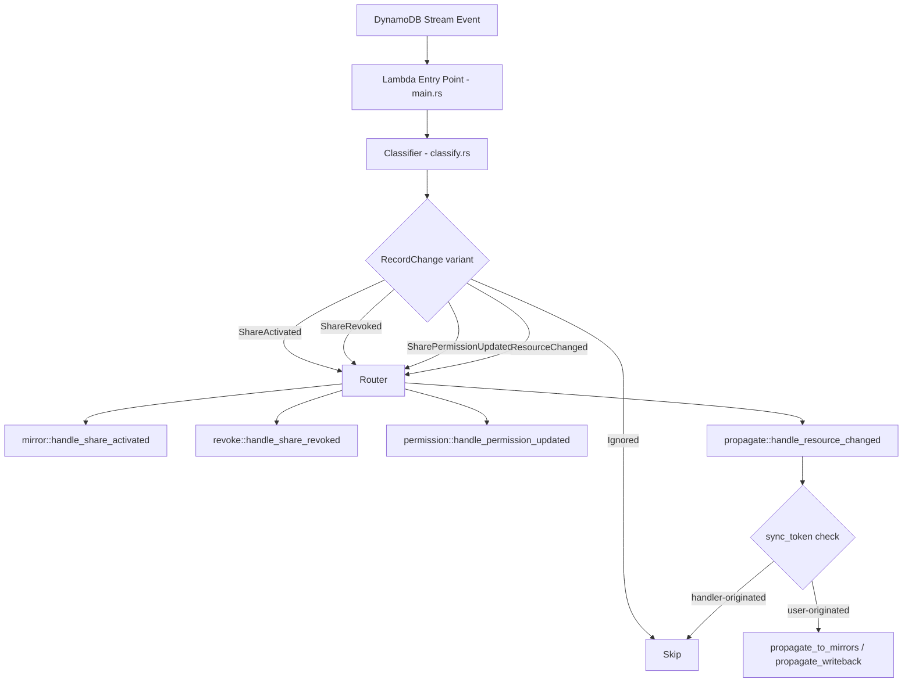

# Design Document: Stream Handler Improvements

## Overview

This design refactors the `famtrac-stream-handler` from a ~1500-line monolith (`src/main.rs`) into a modular, classify-and-route architecture. The refactoring addresses six concerns:

1. A **Router** that decouples classification from processing, enabling composable handler registration.
2. Replacing the `find_owner_for_family` **table Scan** with a narrower `family_id-index` GSI query that returns active shares directly.
3. Implementing **share revocation cleanup** to delete all mirrored records when a share is removed.
4. A **unified share parser** that eliminates the duplicated `parse_share_from_image` / `parse_share_from_ddb_item` functions.
5. **Module decomposition** of the monolith into focused Rust modules.
6. A **`sync_token`** attribute stamped on handler-originated writes to break the infinite write-back cycle.

The handler continues to run as a single AWS Lambda function triggered by DynamoDB Streams. The external contract (input: `DynamoDbEvent`, output: `StreamHandlerResponse` with `batchItemFailures`) is unchanged.

## Architecture

### High-Level Flow



### Module Layout

```
famtrac-stream-handler/src/
├── main.rs              # Lambda bootstrap, DDB client init, top-level dispatch
├── classify.rs          # RecordChange enum, classify_record(), helpers
├── router.rs            # Router struct, handler registration, dispatch
├── handlers/
│   ├── mod.rs           # Re-exports
│   ├── mirror.rs        # Share activation → mirror resources
│   ├── revoke.rs        # Share revocation → delete mirrored records
│   ├── permission.rs    # Permission scope updates on mirrored records
│   └── propagate.rs     # Resource change fan-out + write-back + sync_token
├── parser.rs            # Unified share parser (serde_dynamo::Item + HashMap)
└── dynamo_util.rs       # get_item, query_items, put_item, delete_item, conditional_put, etc.
```

### Router Design

The Router is a simple dispatch table that maps `RecordChange` discriminants to async handler functions. It is not a generic pub/sub system — it is a focused, internal dispatcher for the stream handler's known set of event types.

```rust
/// Discriminant used as the routing key.
#[derive(Debug, Clone, Copy, PartialEq, Eq, Hash)]
pub enum ChangeKind {
    ShareActivated,
    ShareRevoked,
    SharePermissionUpdated,
    ResourceChanged,
}

/// A handler function signature. Receives the DDB client, table name,
/// and the classified RecordChange. Returns Ok(()) or an error.
pub type HandlerFn = Box<
    dyn Fn(Arc<Client>, String, RecordChange) -> Pin<Box<dyn Future<Output = Result<(), Error>> + Send>>
        + Send
        + Sync,
>;

pub struct Router {
    handlers: HashMap<ChangeKind, Vec<HandlerFn>>,
}
```

Key behaviors:
- `Router::register(kind: ChangeKind, handler: HandlerFn)` — appends a handler for the given kind.
- `Router::dispatch(change: RecordChange)` — resolves the `ChangeKind`, invokes all registered handlers. If one handler errors, the others still execute. All errors are collected and the first is returned (or a combined error).
- `Ignored` variants are never dispatched — the router skips them.

The router is constructed once during Lambda cold-start in `main.rs` and reused across invocations.


## Components and Interfaces

### 1. Classifier (`classify.rs`)

Owns the `RecordChange` enum, `ResourceChange` struct, `ChangeOperation` enum, and the pure function `classify_record`. Moved verbatim from `main.rs` with one addition: when producing `ResourceChanged`, the classifier checks for semantic no-op changes (old image == new image after stripping `sync_token`) and returns `Ignored` instead.

Public interface:
```rust
pub fn classify_record(record: &EventRecord) -> RecordChange;
pub fn change_kind(rc: &RecordChange) -> Option<ChangeKind>;  // None for Ignored
```

Helper functions `get_str`, `record_type_from_sk`, `is_owner_partition`, `classify_share_record`, and `convert_image` move here as private.

### 2. Unified Share Parser (`parser.rs`)

Replaces both `parse_share_from_image` and `parse_share_from_ddb_item` with a single entry point that normalizes either input format into a common intermediate representation before parsing.

```rust
/// Parse a Share from a serde_dynamo::Item (stream image).
pub fn parse_share(image: &serde_dynamo::Item) -> Option<Share>;

/// Parse a Share from a raw DynamoDB SDK HashMap (query result).
pub fn parse_share_from_attrs(item: &HashMap<String, DdbAttributeValue>) -> Option<Share>;
```

Implementation strategy: both functions extract string values into a `HashMap<String, String>` (the common intermediate), then call a shared `parse_share_from_strings(map: &HashMap<String, String>) -> Option<Share>`. This guarantees identical parsing logic regardless of input format.

### 3. Router (`router.rs`)

Described in Architecture above. The router does not own any business logic — it only dispatches.

### 4. Handler: Mirror (`handlers/mirror.rs`)

Contains `handle_share_activated`. Moved from `mirror_resources` in `main.rs`. Uses `dynamo_util` for DDB operations. Stamps `sync_token` on every mirrored item written.

### 5. Handler: Revoke (`handlers/revoke.rs`)

New implementation. Handles `ShareRevoked` events.

```rust
pub async fn handle_share_revoked(
    client: &Client,
    table_name: &str,
    share_id: &ShareId,
    old_image: &HashMap<String, DdbAttributeValue>,
) -> Result<(), Error>;
```

Algorithm:
1. Extract `family_id` and `accepter_id` from the old image of the removed share record (Requirement 3.6).
2. Delete the mirrored Family record: `PK=OWNER#{accepter_id}, SK=FAMILY#{family_id}` where `share_id` matches.
3. Query all Dependents under `PK=FAMILY#{family_id}` with `share_id = {share_id}`, delete each.
4. For each dependent, query Activities under `PK=FAMILY#{family_id}#DEPENDENT#{dep_id}` with `share_id = {share_id}`, delete each.
5. All deletes are idempotent — `delete_item` on a non-existent key succeeds silently (Requirement 3.5).

The `RecordChange::ShareRevoked` variant is expanded to carry the old image so the handler can extract `family_id` and `accepter_id`:

```rust
pub enum RecordChange {
    ShareRevoked {
        share_id: ShareId,
        family_id: FamilyId,
        accepter_id: IdentityId,
    },
    // ... other variants unchanged
}
```

### 6. Handler: Permission Update (`handlers/permission.rs`)

Contains `handle_permission_updated`. Moved from `update_mirrored_permissions` in `main.rs`. No functional changes.

### 7. Handler: Propagate (`handlers/propagate.rs`)

Contains `handle_resource_changed`, `propagate_to_mirrors`, and `propagate_writeback`. Key changes:

- **`sync_token` stamping**: Every `put_item` call in `propagate_to_mirrors` and `propagate_writeback` adds a `sync_token` attribute to the written item.
- **`sync_token` filtering**: Before propagating, check if the new image contains a `sync_token` matching the current processing token. If so, skip (the write was handler-originated).
- **Semantic diff**: Before `propagate_writeback` issues a `put_item` for a Family record, compare the stripped new image against the existing owner record. Skip if identical (Requirement 6.7).
- **Active shares lookup**: Calls `find_active_shares_by_family_id` which queries the `family_id-index` GSI. The owner comes for free from `requester_id` on the returned share records, eliminating the need for a separate owner lookup step.

### 8. DynamoDB Utilities (`dynamo_util.rs`)

All low-level DDB operations moved here: `get_item`, `query_items`, `put_item`, `delete_item`, `conditional_put`, `conditional_update_permission`, `find_active_shares_by_family_id`, `rekey_item`, `annotate_item`, `convert_image`.

The old `find_owner_for_family` (table Scan) and `find_active_shares_for_family` (owner-partition query) are replaced by a single function that queries the `family_id-index` GSI:

```rust
pub async fn find_active_shares_by_family_id(
    client: &Client,
    table_name: &str,
    family_id: &str,
) -> Result<Vec<Share>, Error> {
    // Query GSI "family_id-index" where family_id = {family_id}
    // AND begins_with(SK, "SHARE#"), with a filter for status = active.
    let result = client
        .query()
        .table_name(table_name)
        .index_name("family_id-index")
        .key_condition_expression("family_id = :fid AND begins_with(SK, :sk_prefix)")
        .filter_expression("#st = :active")
        .expression_attribute_names("#st", "status")
        .expression_attribute_values(":fid", DdbAttributeValue::S(family_id.to_string()))
        .expression_attribute_values(":sk_prefix", DdbAttributeValue::S("SHARE#".to_string()))
        .expression_attribute_values(":active", DdbAttributeValue::S("active".to_string()))
        .send()
        .await?;
    let items = result.items.unwrap_or_default();
    items.iter().filter_map(parse_share_from_attrs).collect()
}
```

This collapses the previous two-step lookup (find owner → find active shares) into a single GSI query. The `requester_id` field on each returned `Share` is the family owner. The GSI only indexes items that have a `family_id` attribute (shares, dependents, activities), making it much narrower than a full inverted index.

### 9. `sync_token` Mechanism (Requirement 6)

The `sync_token` is a string attribute added to every item written by the stream handler. Its value is a unique identifier generated once per Lambda invocation (e.g., the Lambda request ID or a UUID).

```rust
// In main.rs, generated once per invocation:
let sync_token = event.context.request_id.clone();
```

Rules:
- `propagate_to_mirrors` stamps `sync_token` on every mirrored item it writes.
- `propagate_writeback` stamps `sync_token` on every item it writes back.
- `mirror_resources` (share activation) stamps `sync_token` on every mirrored item.
- The classifier strips `sync_token` before comparing old/new images for semantic equality (Requirement 6.3, 6.5).
- `propagate_change` checks: if `new_image` contains `sync_token`, skip propagation (Requirement 6.4).
- If `sync_token` is absent from a stream record, the record is treated as user-originated (Requirement 6.6).

This breaks the cycle:
1. User writes to owner partition → stream event (no `sync_token`) → `propagate_to_mirrors` writes mirrored copy with `sync_token`.
2. Mirrored copy write → stream event (has `sync_token`) → `propagate_change` sees `sync_token` → skips. Cycle broken.

Similarly for write-back:
1. Accepter writes to mirrored record → stream event (no `sync_token`) → `propagate_writeback` writes to owner with `sync_token`.
2. Owner record write → stream event (has `sync_token`) → `propagate_change` sees `sync_token` → skips. Cycle broken.


## Data Models

### Existing Domain Types (unchanged)

From `famtrac-backend/src/domain/`:

| Type | Description |
|------|-------------|
| `Share` | Full share record with id, family_id, requester_id, accepter_id, permission_scope, status, timestamps |
| `ShareId` | Newtype over `Uuid` |
| `FamilyId` | Newtype over `Uuid` |
| `IdentityId` | Newtype over `String` |
| `ShareStatus` | Enum: `Pending`, `Active`, `Expired` |
| `PermissionScope` | Struct with `actions: Vec<PermissionAction>` |
| `Timestamp` | Newtype over `DateTime<Utc>` |

### Modified Enums

#### `RecordChange` (expanded)

```rust
pub enum RecordChange {
    ShareActivated(Share),
    ShareRevoked {
        share_id: ShareId,
        family_id: FamilyId,
        accepter_id: IdentityId,
    },
    SharePermissionUpdated(Share),
    ResourceChanged(ResourceChange),
    Ignored,
}
```

The `ShareRevoked` variant changes from `ShareRevoked(ShareId)` to a struct variant carrying `family_id` and `accepter_id` extracted from the old image. This avoids a secondary lookup during revocation cleanup.

#### `ChangeKind` (new)

```rust
#[derive(Debug, Clone, Copy, PartialEq, Eq, Hash)]
pub enum ChangeKind {
    ShareActivated,
    ShareRevoked,
    SharePermissionUpdated,
    ResourceChanged,
}
```

Used as the routing key in the Router's dispatch table.

### New Attributes on DynamoDB Items

| Attribute | Type | Description |
|-----------|------|-------------|
| `sync_token` | `String` | Stamped on every item written by the stream handler. Value is the Lambda request ID for the current invocation. Used to detect handler-originated writes and break infinite propagation cycles. |

The `sync_token` attribute is:
- Written by: `mirror_resources`, `propagate_to_mirrors`, `propagate_writeback`
- Checked by: `propagate_change` (skip if present)
- Stripped by: classifier before semantic image comparison; never returned through client-facing APIs

### GSI: `family_id-index`

A sparse GSI on the `FamtracData` table that only indexes items possessing a `family_id` attribute (shares, dependents, activities):

| GSI Attribute | Table Attribute |
|---------------|-----------------|
| Partition Key | `family_id` |
| Sort Key | `SK` |

Projection: `INCLUDE` — projected attributes: `requester_id`, `accepter_id`, `accepter_username`, `permission_scope`, `status`, `id`, `created_at`, `updated_at`, `expires_at`.

This GSI enables `find_active_shares_by_family_id` to query `family_id = X AND begins_with(SK, "SHARE#")` with a filter `status = active`. Because the GSI is sparse (only items with `family_id` are indexed), it is much narrower than a full inverted index and avoids replicating every item in the table.


## Correctness Properties

*A property is a characteristic or behavior that should hold true across all valid executions of a system — essentially, a formal statement about what the system should do. Properties serve as the bridge between human-readable specifications and machine-verifiable correctness guarantees.*

### Property 1: Router dispatches to all matching handlers

*For any* set of handler registrations and *for any* `RecordChange` variant, the Router shall invoke exactly the set of handlers registered for that variant's `ChangeKind`, and no others. Adding a new handler for a given `ChangeKind` shall not prevent previously registered handlers from being invoked.

**Validates: Requirements 1.2, 1.3**

### Property 2: Router error isolation

*For any* set of registered handlers where one or more return errors, the Router shall still invoke all remaining handlers for the same `RecordChange`. The set of handlers that executed shall be the full registered set, regardless of which handlers failed.

**Validates: Requirements 1.5**

### Property 3: Owner ID extraction returns None when absent

*For any* DynamoDB image `HashMap` that does not contain an `owner_id` attribute, and whose associated PK does not start with `OWNER#`, the `extract_owner_id` function shall return `None`.

**Validates: Requirements 2.2**

### Property 4: Revocation cleanup deletes all mirrored records for a share

*For any* set of mirrored records (Family, Dependent, Activity) annotated with a given `share_id`, and *for any* revocation event for that `share_id`, the revocation handler shall issue delete operations for every record whose `share_id` matches, and for no records whose `share_id` does not match.

**Validates: Requirements 3.2, 3.3, 3.4**

### Property 5: Revocation extracts family_id and accepter_id from old image

*For any* share old image containing valid `family_id` and `accepter_id` fields, the classifier shall produce a `ShareRevoked` variant carrying those extracted values. *For any* old image missing either field, the classifier shall produce `Ignored`.

**Validates: Requirements 3.6**

### Property 6: Missing required field yields None from parser

*For any* valid Share representation with any single required field removed, the unified share parser shall return `None`, regardless of whether the input is a `serde_dynamo::Item` or a `HashMap<String, DdbAttributeValue>`.

**Validates: Requirements 4.3**

### Property 7: Parser equivalence across input formats

*For any* valid `Share` value, converting it to a `serde_dynamo::Item` and parsing it shall produce the same `Share` as converting it to a `HashMap<String, DdbAttributeValue>` and parsing it.

**Validates: Requirements 4.4**

### Property 8: Refactored classifier produces identical output

*For any* valid `EventRecord`, the refactored `classify_record` function shall produce the same `RecordChange` variant (with the same payload) as the original monolithic implementation.

**Validates: Requirements 5.3**

### Property 9: Handler writes always include sync_token

*For any* item written by `propagate_to_mirrors`, `propagate_writeback`, or `mirror_resources`, the resulting DynamoDB item shall contain a `sync_token` attribute with a non-empty string value.

**Validates: Requirements 6.1, 6.2**

### Property 10: Semantic no-op changes are classified as Ignored

*For any* `ResourceChanged` event where the old and new images are semantically identical after stripping the `sync_token` attribute, the classifier shall produce `Ignored`.

**Validates: Requirements 6.3**

### Property 11: sync_token presence determines propagation skip

*For any* `ResourceChanged` event, propagation shall be skipped if and only if the new image contains a `sync_token` attribute. If `sync_token` is absent, the event shall be processed as a user-originated change.

**Validates: Requirements 6.4, 6.6**

### Property 12: Strip function removes only sync_token

*For any* DynamoDB image `HashMap`, stripping the `sync_token` attribute shall produce a map that is identical to the original except for the absence of the `sync_token` key. All other key-value pairs shall be preserved.

**Validates: Requirements 6.5**

### Property 13: No write-back on semantically identical images

*For any* write-back scenario where the stripped new image is semantically identical to the existing owner record, `propagate_writeback` shall not issue a `put_item` call.

**Validates: Requirements 6.7, 6.8**


## Error Handling

### Classification Errors

The classifier is a pure function that returns `RecordChange::Ignored` for any record it cannot parse or does not recognize. It never panics or returns `Err`. Malformed records (missing PK/SK, unknown SK prefix, unparseable share images) are silently ignored.

### Router Errors

When a handler returns an error, the Router:
1. Logs the error with the record's event ID.
2. Continues invoking remaining handlers for the same record.
3. Collects all errors and returns the first one (or a combined error) to the top-level dispatcher.
4. The top-level dispatcher adds the record's event ID to `batchItemFailures` so Lambda retries only that record.

### DynamoDB Operation Errors

| Operation | Error Handling |
|-----------|---------------|
| `conditional_put` | `ConditionalCheckFailedException` → silently ignored (idempotent) |
| `conditional_update_permission` | `ConditionalCheckFailedException` → silently ignored |
| `delete_item` on non-existent key | DynamoDB returns success → no special handling needed (Req 3.5) |
| `find_active_shares_by_family_id` (GSI query) | Empty result → return empty `Vec`, caller skips propagation |
| `put_item` / `query_items` | SDK errors propagated up → record marked as failed for retry |

### Share Parser Errors

The unified parser returns `Option<Share>`. Any missing required field, unparseable UUID, invalid JSON in `permission_scope`, or unrecognized `status` value results in `None`. Callers handle `None` by skipping the record (returning `Ok(())`).

### sync_token Edge Cases

- Missing `sync_token` on a stream image → treated as user-originated, processed normally.
- `sync_token` present but empty string → treated as handler-originated (skip). The handler never writes an empty `sync_token`.
- Multiple Lambda invocations processing overlapping stream shards → each has a unique `sync_token` (request ID). A record written by invocation A will have A's token. If invocation B sees it, B's token differs, but the presence of any `sync_token` is sufficient to skip — we don't compare token values, just check for presence.

## Testing Strategy

### Property-Based Testing

Library: [`proptest`](https://crates.io/crates/proptest) (Rust). Each property test runs a minimum of 100 iterations.

Each property-based test must be tagged with a comment referencing the design property:
```rust
// Feature: stream-handler-improvements, Property 7: Parser equivalence across input formats
```

Properties and their test locations:

| Property | Test Module | Generator Strategy |
|----------|-------------|-------------------|
| P1: Router dispatch | `router.rs` tests | Random `ChangeKind` sets + random `RecordChange` values |
| P2: Router error isolation | `router.rs` tests | Random handler sets with random Ok/Err outcomes |
| P3: Owner ID extraction | `handlers/propagate.rs` tests | Random `HashMap` images with/without `owner_id`, random PK strings |
| P4: Revocation cleanup completeness | `handlers/revoke.rs` tests | Random sets of items with various `share_id` values |
| P5: Revocation field extraction | `classify.rs` tests | Random share old images with/without `family_id` and `accepter_id` |
| P6: Missing field → None | `parser.rs` tests | Valid share data with one random field removed |
| P7: Parser equivalence | `parser.rs` tests | Random valid `Share` values, converted to both formats |
| P8: Classifier equivalence | `classify.rs` tests | Random `EventRecord` values |
| P9: Handler writes include sync_token | `handlers/propagate.rs` tests | Random items passed through stamp function |
| P10: Semantic no-op detection | `classify.rs` tests | Random images, duplicated with optional `sync_token` added |
| P11: sync_token propagation skip | `handlers/propagate.rs` tests | Random `ResourceChanged` events with/without `sync_token` |
| P12: Strip function | `handlers/propagate.rs` tests or `dynamo_util.rs` tests | Random `HashMap` images with random `sync_token` values |
| P13: No write-back on identical | `handlers/propagate.rs` tests | Random image pairs, some identical, some different |

### Unit Testing

Unit tests focus on specific examples, edge cases, and integration points. All existing tests from the monolith are preserved and relocated to their owning modules.

Key unit test areas:
- **Classifier**: Existing tests for share activation, revocation, permission update, pending share ignored, email partition ignored, resource changed variants. These move to `classify.rs`.
- **Share parser**: Specific examples of valid/invalid share images. Edge cases: missing optional fields (`accepter_id`, `expires_at`), malformed UUIDs, invalid JSON in `permission_scope`.
- **Revocation**: Example: revoke a share with 2 dependents and 3 activities → verify 6 delete calls (1 family + 2 dependents + 3 activities). Edge case: revoke with no mirrored records → no errors.
- **sync_token**: Example: item with `sync_token` → skipped. Item without → processed. Semantic no-op with `sync_token` difference only → `Ignored`.
- **DynamoDB utilities**: Existing tests for `extract_family_id`, `extract_owner_id`, `is_mirrored_resource`, `rekey_item`, `annotate_item`. These move to `dynamo_util.rs`.

### Integration Testing

Integration tests (not property-based) should verify end-to-end flows against DynamoDB Local:
- Share activation → mirrored records created with `sync_token`.
- Share revocation → all mirrored records deleted.
- Resource change on owner → propagated to mirrors with `sync_token`, no infinite loop.
- Resource change on mirror → written back to owner with `sync_token`, no infinite loop.
- `family_id-index` GSI query returns correct active shares and owner can be derived from `requester_id`.

These tests use the existing `dynamodb/DynamoDBLocal.jar` in the repo.

